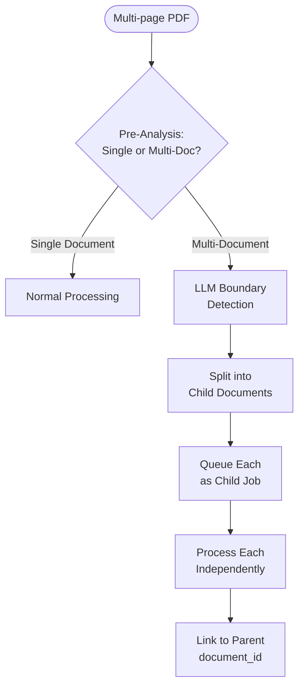
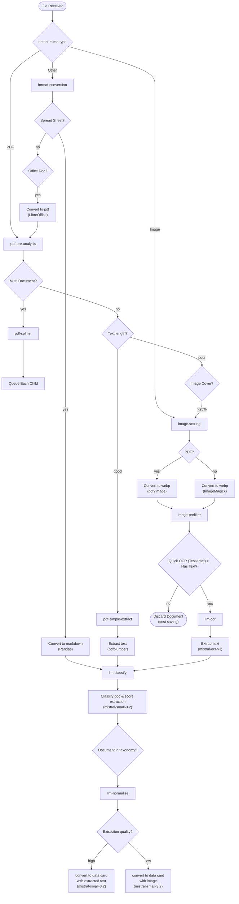

# 📄 Document Types & Processing Paths

**Comprehensive analysis of document formats, MIME types, and processing pipelines**

> **Status**: Exploration Document  
> **Last Updated**: February 2026

---

## 1️⃣ Document Types Taxonomy

### A. Official & Corporate Sources

| Type                 | Description                               | Common Formats   | Frequency |
| :------------------- | :---------------------------------------- | :--------------- | :-------- |
| **Native PDFs**      | Born-digital PDFs from institutions       | PDF (text layer) | ~60%      |
| **Scanned PDFs**     | Digitized paper (contracts, signed docs)  | PDF (image-only) | ~20%      |
| **Signed PDFs**      | Contracts with digital/scanned signatures | PDF (mixed)      | ~5%       |
| **Bank Statements**  | Online banking exports                    | PDF (text layer) | ~8%       |
| **Payslips**         | HR system exports                         | PDF (text layer) | ~5%       |
| **Government Forms** | Cerfa, CAF, impots.gouv                   | PDF (structured) | ~2%       |

### B. User-Scanned Documents

| Type               | Description                     | Common Formats   | Frequency |
| :----------------- | :------------------------------ | :--------------- | :-------- |
| **Phone Photos**   | Camera captures of documents    | JPEG, HEIC, PNG  | ~40%      |
| **Scanned Images** | Flatbed/app scanner output      | PDF, TIFF, PNG   | ~25%      |
| **Scanner Apps**   | CamScanner, Adobe Scan, etc.    | PDF (image-only) | ~20%      |
| **Word + Image**   | Document pasted into Word/Pages | DOCX, ODT        | ~10%      |
| **XPS Documents**  | Windows print-to-XPS            | XPS, OXPS        | ~3%       |
| **HEIC/HEIF**      | iOS native photo format         | HEIC, HEIF       | ~2%       |

### C. Personal/Business Documents

| Type                  | Description                 | Common Formats  | Frequency |
| :-------------------- | :-------------------------- | :-------------- | :-------- |
| **Letters**           | Typed correspondence        | DOCX, ODT, PDF  | ~30%      |
| **Spreadsheets**      | Financial tracking, budgets | XLSX, ODS, CSV  | ~25%      |
| **Invoice Templates** | Business invoices           | XLSX, DOCX, PDF | ~20%      |
| **Notes/Memos**       | Quick notes with doc info   | TXT, MD, PDF    | ~15%      |
| **Forms**             | Filled templates            | PDF, DOCX       | ~10%      |

### D. Email-Based Documents

| Type                  | Description            | Common Formats | Frequency |
| :-------------------- | :--------------------- | :------------- | :-------- |
| **Email Files**       | Saved email messages   | EML, MSG       | ~40%      |
| **Email Attachments** | Various (PDFs, images) | (extracted)    | ~55%      |
| **Email Body**        | Important text in body | EML → text     | ~5%       |

### E. Web-Based Documents

| Type                | Description           | Common Formats   | Frequency |
| :------------------ | :-------------------- | :--------------- | :-------- |
| **Webpage Saves**   | Saved HTML pages      | HTML, MHT, MHTML | ~50%      |
| **Webpage + Files** | Complete webpage save | HTML + folder    | ~25%      |
| **Web Screenshots** | Browser screenshots   | PNG, JPEG        | ~15%      |
| **Print to PDF**    | Browser print output  | PDF              | ~10%      |

### F. Specialty Formats (Outliers)

| Type              | Description           | Common Formats        | Frequency |
| :---------------- | :-------------------- | :-------------------- | :-------- |
| **Legacy Office** | Old Microsoft formats | DOC, XLS, PPT         | ~5%       |
| **Rich Text**     | Cross-platform text   | RTF                   | ~3%       |
| **OpenDocument**  | LibreOffice formats   | ODT, ODS, ODP         | ~2%       |
| **Apple Formats** | macOS/iOS native      | PAGES, NUMBERS        | ~1%       |
| **Fax Documents** | Received faxes        | TIFF (multipage), PDF | ~0.5%     |
| **Archives**      | Compressed bundles    | ZIP, RAR              | ~0.5%     |

---

## 2️⃣ Acceptable MIME Types

### Core Document Types

```typescript
const ALLOWED_MIME_TYPES = [
  // PDF
  "application/pdf",

  // Images (photos, scans)
  "image/jpeg",
  "image/png",
  "image/tiff",
  "image/webp",
  "image/heic",
  "image/heif",
  "image/bmp",
  "image/gif", // rare but possible

  // Microsoft Office (modern)
  "application/vnd.openxmlformats-officedocument.wordprocessingml.document", // .docx
  "application/vnd.openxmlformats-officedocument.spreadsheetml.sheet", // .xlsx
  "application/vnd.openxmlformats-officedocument.presentationml.presentation", // .pptx

  // Microsoft Office (legacy)
  "application/msword", // .doc
  "application/vnd.ms-excel", // .xls
  "application/vnd.ms-powerpoint", // .ppt

  // OpenDocument (LibreOffice)
  "application/vnd.oasis.opendocument.text", // .odt
  "application/vnd.oasis.opendocument.spreadsheet", // .ods
  "application/vnd.oasis.opendocument.presentation", // .odp

  // Plain text
  "text/plain",
  "text/csv",
  "text/markdown",

  // Rich text
  "application/rtf",
  "text/rtf",

  // Email
  "message/rfc822", // .eml
  "application/vnd.ms-outlook", // .msg

  // Web saves
  "text/html",
  "application/x-mimearchive", // .mht/.mhtml
  "multipart/related", // .mhtml variant

  // XPS (Microsoft alternative to PDF)
  "application/vnd.ms-xpsdocument", // .xps
  "application/oxps", // .oxps

  // Apple formats (require conversion)
  "application/vnd.apple.pages",
  "application/vnd.apple.numbers",
];
```

### Updated `mime-detection.ts` Prefixes

```typescript
/**
 * Allowed MIME type prefixes for document upload.
 * Comprehensive list for DocGather document processing.
 */
const ALLOWED_MIME_PREFIXES = [
  // PDF
  "application/pdf",

  // All images
  "image/",

  // Microsoft Office (all variants)
  "application/msword",
  "application/vnd.openxmlformats-officedocument",
  "application/vnd.ms-",

  // OpenDocument
  "application/vnd.oasis.opendocument",

  // Apple
  "application/vnd.apple",

  // Text-based
  "text/plain",
  "text/csv",
  "text/markdown",
  "text/html",
  "text/rtf",
  "application/rtf",

  // Email
  "message/rfc822",

  // Web archives
  "application/x-mimearchive",
  "multipart/related",

  // XPS
  "application/vnd.ms-xpsdocument",
  "application/oxps",
];
```

---

## 3️⃣ Simplified PDF Processing Flow

> [!NOTE]
> **Design Decision**: After benchmarking, we chose a simple two-tier approach over complex RAG-style pipelines.
> pdfplumber and PyMuPDF4LLM have identical speed (~100ms/doc). pdfplumber wins on table extraction.
> Marker is 100x slower and requires GPU + 4GB VRAM—overkill when LLM Vision covers edge cases.

### PDF Decision Tree (Reactive Orchestrator)

```
PDF received by orchestrator
  │
  ├─ Step 1: Pre-Analysis (pdf-pre-analysis worker)
  │    ├─ Multi-document? → pdf-splitter → create child docs → each re-enters pipeline
  │    └─ Single document → Routing step
  │
  ├─ Step 2: Routing (based on pre-analysis)
  │    ├─ Good text quality → pdf-simple-extract (pdfplumber)
  │    └─ Poor/no text → image-scaling → image-prefilter (Tesseract)
  │                        ↓ (has text?)
  │                      llm-ocr (LLM Vision)
  │
  ├─ Step 3: Classify (llm-classify)
  ├─ Step 4: Normalize (llm-normalize)
  ├─ Step 5: Thumbnail (thumbnail-generation)
  └─ Finalize: aggregate results → Supabase RPC

> [!NOTE]
> All file access (download/upload) is handled via **Encrypted Edge Functions** (`storage-download`, `storage-upload`) to ensure end-to-end encryption. Workers never see or store plaintext keys.
```

### Why This is Enough for DocGather

| Factor              | Rationale                                          |
| :------------------ | :------------------------------------------------- |
| **Document size**   | 1-10 pages typical (payslips, IDs, contracts)      |
| **Context windows** | 200K+ tokens available (GPT-4o, Claude 3.5)        |
| **Goal**            | Classification + extraction, not RAG/search        |
| **Cost**            | Vision on ~20% of docs cheaper than Marker on 100% |

> [!WARNING]
> **Token Limit Protection**: Extracted text from any source (PDF, TXT, CSV, or Spreadsheet) is hard-truncated at **50,000 characters** before reaching the LLM. This prevents context window explosions on extremely long documents. The string `\n\n...[TRUNCATED]` is appended when truncation occurs.

---

## 4️⃣ LLM Processing Stages Explained

> [!IMPORTANT]
> The stages are **conceptually separate** but can be **combined in a single prompt** for efficiency.
> They represent distinct concerns, not necessarily separate API calls.

### Stage 1: Pre-Analysis (optional)

**Purpose**: Quick scan to detect special cases before full processing.

**Detects**:

- Multi-document files (see Section 5)
- Document quality issues
- Language detection
- Page count assessment

### Stage 2: Classification

**Purpose**: Identify the document type to select the appropriate extraction schema.

**Input**: Extracted text (from pdfplumber) or page images (for vision)

**Output**:

```json
{
  "document_type": "income.payslip",
  "confidence": 0.94,
  "language": "fr",
  "issuer_hint": "Acme Corp",
  "date_hint": "2025-12"
}
```

**Why it matters**: Different document types have different extraction schemas:

- Payslip → `gross_salary`, `net_salary`, `employer`
- Passport → `nationality`, `expiry_date`, `passport_number`

### Stage 3: Extraction

**Purpose**: Extract structured data using the schema for the classified document type.

**Input**: Same text/images + classification result + type-specific schema

**Output** (example for payslip):

```json
{
  "template": "income.payslip",
  "employee_name": "Jean Dupont",
  "employer": "Acme Corp",
  "period": "2025-12",
  "gross_salary": 3500.0,
  "net_salary": 2730.0,
  "currency": "EUR"
}
```

### Single-Prompt vs Multi-Prompt

| Approach          | When to Use                         | Trade-offs                   |
| :---------------- | :---------------------------------- | :--------------------------- |
| **Single prompt** | Standard documents, high confidence | Faster, cheaper, 1 API call  |
| **Two prompts**   | Unknown types, low confidence       | Better accuracy, 2 API calls |

**Recommended default**: Single prompt with classification + extraction combined:

```
Analyze this document:
1. Classify the document type from: [payslip, passport, utility_bill, ...]
2. Extract data according to the schema for that type
3. Return both classification and extracted data

Document content:
{text or "See attached images"}
```

---

## 5️⃣ Multi-Document Detection & Handling

> [!WARNING]
> **Common scenario**: User uploads a single PDF containing scans of multiple family passports,
> or a document bundle with payslips + contract + ID.

### Detection Signals

| Signal                        | Example                                      |
| :---------------------------- | :------------------------------------------- |
| **Repeated document headers** | "RÉPUBLIQUE FRANÇAISE" appearing 3 times     |
| **Multiple identity blocks**  | Different names/birthdays on different pages |
| **Visual page breaks**        | Obvious document boundaries                  |
| **Mixed document types**      | Payslip on page 1, contract on page 3        |

### Processing Flow



### LLM Detection Output

```json
{
  "is_multi_document": true,
  "document_count": 3,
  "documents": [
    { "type": "passport", "pages": [1, 2], "identity_hint": "Jean Dupont" },
    { "type": "passport", "pages": [3, 4], "identity_hint": "Marie Dupont" },
    { "type": "passport", "pages": [5, 6], "identity_hint": "Lucas Dupont" }
  ]
}
```

### Database Modeling

```sql
-- Parent document (the original uploaded file)
documents (
  id: uuid,
  is_bundle: boolean,
  bundle_detection_method: text  -- 'page_split', 'boundary_detection'
)

-- Child documents (extracted from bundle)
documents (
  id: uuid,
  parent_document_id: uuid,      -- FK to parent bundle
  bundle_page_range: int4range   -- e.g., '[1,3)' for pages 1-2
)
```

### Implementation Strategy

1. **First pass**: LLM analyzes full document for multi-doc signals
2. **If detected**: Create child documents with page references
3. **Process each child**: Normal classification + extraction
4. **User verification**: Show detected split, allow corrections

---

## 6️⃣ Processing Paths by MIME Type

| MIME Type                                             | Extension(s) | Est. % | Processing Path                            |
| :---------------------------------------------------- | :----------- | :----- | :----------------------------------------- |
| **application/pdf**                                   | pdf          | 45%    | pdfplumber → (good text? LLM : LLM Vision) |
| **image/jpeg**                                        | jpg, jpeg    | 20%    | image-scaling → llm-ocr (LLM Vision)       |
| **image/png**                                         | png          | 10%    | image-scaling → llm-ocr (LLM Vision)       |
| **image/heic**                                        | heic, heif   | 3%     | image-scaling → llm-ocr (LLM Vision)       |
| **image/tiff**                                        | tif, tiff    | 1%     | image-scaling → llm-ocr (LLM Vision)       |
| **application/vnd.openxmlformats...wordprocessingml** | docx         | 8%     | python-docx → LLM                          |
| **application/vnd.openxmlformats...spreadsheetml**    | xlsx         | 4%     | openpyxl → LLM                             |
| **application/msword**                                | doc          | 1%     | LibreOffice → PDF → pdfplumber → LLM       |
| **application/vnd.ms-excel**                          | xls          | 0.5%   | LibreOffice → PDF → pdfplumber → LLM       |
| **application/vnd.oasis.opendocument.text**           | odt          | 0.5%   | LibreOffice → PDF → pdfplumber → LLM       |
| **text/plain**                                        | txt          | 0.5%   | Direct read → LLM                          |
| **text/csv**                                          | csv          | 0.5%   | Parse CSV → LLM                            |
| **message/rfc822**                                    | eml          | 2%     | Parse → Extract attachments → Recurse      |
| **application/vnd.ms-outlook**                        | msg          | 0.5%   | Parse → Extract attachments → Recurse      |
| **text/html**                                         | html, htm    | 1%     | BeautifulSoup → LLM                        |
| **application/vnd.ms-xpsdocument**                    | xps          | 0.2%   | xpstopdf → pdfplumber → LLM                |
| **application/rtf**                                   | rtf          | 0.3%   | LibreOffice → PDF → pdfplumber → LLM       |
| **application/vnd.apple.pages**                       | pages        | 0.1%   | Extract preview.pdf → pdfplumber → LLM     |

---

## 7️⃣ Complete Processing Flowchart (Reactive Orchestrator)



> [!NOTE]
> Each arrow in this diagram represents a `moveToWaitingChildren` → suspend → resume cycle
> in the orchestrator state machine. The orchestrator only spawns the next child after
> reading the previous child's result.

---

## 8️⃣ Image Scaling Strategy

| Original Size | Action       | Output               |
| :------------ | :----------- | :------------------- |
| ≤ 1024px      | No scaling   | Original             |
| 1024-4096px   | Scale down   | 1024px longest side  |
| > 4096px      | Scale + warn | 1024px, flag quality |

### Multi-Page PDFs (Scanned)

1. Convert each page to image (150-200 DPI)
2. Scale each to 1024px max
3. Batch process (max 5 pages per LLM call)
4. Merge extraction results

---

## 9️⃣ Special Format Handling

| Format                       | Strategy                                        |
| :--------------------------- | :---------------------------------------------- |
| **Apple (.pages, .numbers)** | Extract `preview.pdf` from ZIP, process as PDF  |
| **Email (.eml, .msg)**       | Parse, extract attachments, queue each as child |
| **Multi-page TIFF**          | Split pages, convert to PNG, vision pipeline    |
| **XPS/OXPS**                 | Convert with `xpstopdf`, process as PDF         |

---

## 🔟 Tool Dependencies

| Tool | Purpose |

| :------------------------- | :------------------------------------ |
| `pdfplumber` | PDF text extraction (best for tables) |
| `Pillow` + `pillow-heif` | Image manipulation, HEIC support |
| `pdf2image` + poppler | PDF → images for vision |
| `python-docx` / `openpyxl` | Office document extraction |
| `LibreOffice` (headless) | Legacy Office → PDF |
| `extract-msg` | Outlook MSG parsing |
| `beautifulsoup4` | HTML parsing |
| `tesseract-ocr` | Efficient text pre-filtering (detects empty pages) |

> [!NOTE]
> **Tesseract role**: Only used for **pre-filtering** (checking if text exists) to save LLM costs.
> LLM Vision is still used for the actual high-quality extraction.

---

_Document Types & Processing Paths • DocGather Architecture • February 2026_
