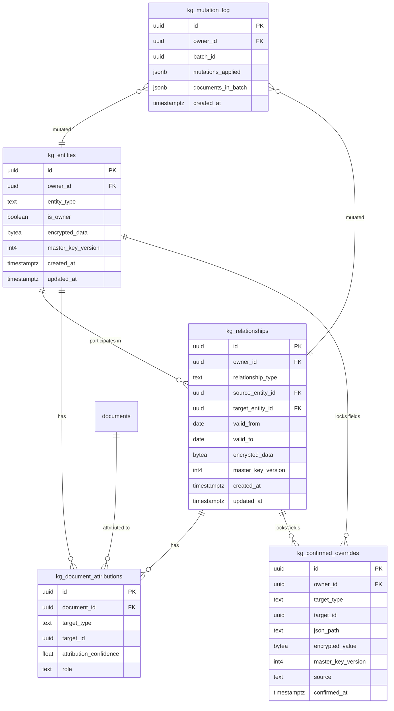
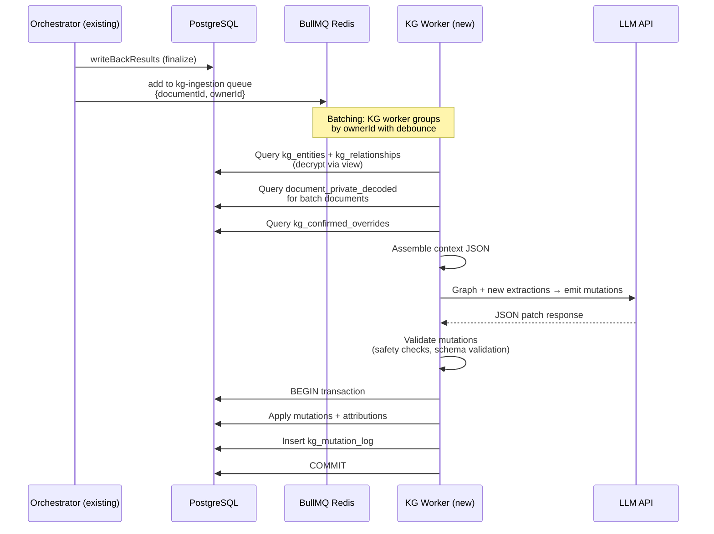

# Knowledge Graph Architecture

> **Version**: 0.2 — Ultrathink Review
> **Last Updated**: March 2026
> **Status**: Draft — Pending Review

---

## 🎯 Purpose

DocGather's processing pipeline (see [processing-workers.md](../processing-workers.md)) already extracts structured data from every document: the `llm-classify` worker assigns a `document_type` and the `llm-normalize` worker extracts typed fields (name, salary, address, dates…). That extracted data lives encrypted in `document_private.encrypted_extracted_data`.

The **Knowledge Graph** is the layer that sits _above_ individual documents. It synthesizes all extractions into a single, interconnected model of the owner's world — people, companies, and the relationships between them.

### Three jobs

1. **Contextual Understanding** — A master record of the owner's domain (family members, employers, landlords, administrations).
2. **Document Attribution** — Routing each document to the correct entity or relationship (a passport → an individual; a joint tax notice → a marriage; an employment contract → an employee-employer relationship).
3. **Application Autocomplete** — The source of truth when the owner fills out a dossier (rental application, bank loan, school enrollment…).

---

## 🏗️ Data Model

### Entity Relationship Diagram



### 1. `kg_entities`

Represents independent actors: people, companies, administrations.

| Column               | Type                   | Notes                                                    |
| :------------------- | :--------------------- | :------------------------------------------------------- |
| `id`                 | UUID PK                |                                                          |
| `owner_id`           | UUID FK → `auth.users` | Scopes the entire graph to one user                      |
| `entity_type`        | TEXT                   | `individual`, `business`, `non_profit`, `administration` |
| `is_owner`           | BOOLEAN                | Exactly one per `owner_id` (the user themselves)         |
| `encrypted_data`     | BYTEA                  | Encrypted JSONB — see structure below                    |
| `master_key_version` | INT                    | For key rotation, same pattern as `document_private`     |
| `created_at`         | TIMESTAMPTZ            |                                                          |
| `updated_at`         | TIMESTAMPTZ            |                                                          |

> [!IMPORTANT]
> **Encryption**: Entity data contains Tier B PII (names, addresses, birth dates). It MUST be encrypted at rest using the same `encrypt_jsonb` / `decrypt_jsonb` pattern as `document_private` (see [documents.md § JSONB Encryption](../documents.md)).

**Decrypted `data` structure** (example for an individual):

```json
{
  "first_name": {
    "value": "Jean",
    "confidence": 0.95,
    "proofs": ["doc_id_123", "doc_id_456"]
  },
  "last_name": {
    "value": "Dupont",
    "confidence": 0.99,
    "proofs": ["doc_id_123"]
  },
  "date_of_birth": {
    "value": "1985-03-15",
    "confidence": 0.9,
    "proofs": ["doc_id_789"]
  },
  "addresses": [
    {
      "value": "456 Rue de la Paix, 75002 Paris",
      "valid_from": "2023-01",
      "valid_to": null,
      "confidence": 0.88,
      "proofs": ["doc_id_abc"]
    },
    {
      "value": "123 Avenue des Champs, 69001 Lyon",
      "valid_from": "2019-06",
      "valid_to": "2022-12",
      "confidence": 0.92,
      "proofs": ["doc_id_def"]
    }
  ]
}
```

Key design choices:

- **`proofs` is an array**, not a single ID. Multiple documents may corroborate the same fact.
- **Temporal fields** (addresses, employment) are arrays with `valid_from` / `valid_to` to model history, not just current state.
- **`is_owner`** — Every graph is bootstrapped with a "self" entity for the owner on first document ingestion. This entity is the anchor for all relationships.

### 2. `kg_relationships`

Represents connections between two entities, bounded by time.

| Column               | Type                    | Notes                                            |
| :------------------- | :---------------------- | :----------------------------------------------- |
| `id`                 | UUID PK                 |                                                  |
| `owner_id`           | UUID FK                 |                                                  |
| `relationship_type`  | TEXT                    | See type list below                              |
| `source_entity_id`   | UUID FK → `kg_entities` | The "from" side                                  |
| `target_entity_id`   | UUID FK → `kg_entities` | The "to" side                                    |
| `valid_from`         | DATE (nullable)         | When the relationship started                    |
| `valid_to`           | DATE (nullable)         | `NULL` = still active                            |
| `encrypted_data`     | BYTEA                   | Encrypted JSONB for relationship-specific fields |
| `master_key_version` | INT                     |                                                  |

**Relationship types and directionality convention:**

| Type              | Source → Target            | Example `data` fields               |
| :---------------- | :------------------------- | :---------------------------------- |
| `marriage`        | person → person            | `regime`, `wedding_location`        |
| `civil_union`     | person → person            | `pacs_date`                         |
| `parent_child`    | parent → child             |                                     |
| `employee`        | person → company           | `job_title`, `department`, `salary` |
| `company_owner`   | person → company           | `share_percentage`, `role`          |
| `company_partner` | person → company           | `share_percentage`                  |
| `client`          | person → company           | `client_id`, `account_number`       |
| `tenant`          | person → entity (landlord) | `rent_amount`, `address`            |
| `insured`         | person → company (insurer) | `policy_number`, `coverage_type`    |
| `student`         | person → entity (school)   | `program`, `year`                   |
| `beneficiary`     | person → administration    | `benefit_type`, `caf_number`        |

> [!NOTE]
> **Not an enum** — stored as `TEXT` with application-level validation. New relationship types can be added without a migration as document diversity grows.

### 3. `kg_document_attributions`

Links documents to graph nodes. **A single document can have multiple attributions** (e.g., a payslip is attributed to both the employee entity AND the employment relationship).

| Column                   | Type                  | Notes                                                                 |
| :----------------------- | :-------------------- | :-------------------------------------------------------------------- |
| `id`                     | UUID PK               |                                                                       |
| `document_id`            | UUID FK → `documents` |                                                                       |
| `target_type`            | TEXT                  | `entity` or `relationship`                                            |
| `target_id`              | UUID                  | References `kg_entities.id` or `kg_relationships.id`                  |
| `attribution_confidence` | FLOAT                 | 0–1                                                                   |
| `role`                   | TEXT (nullable)       | e.g. `subject`, `issuer`, `recipient` — clarifies HOW the doc relates |

**Attribution patterns by document type:**

| Document            | Attributed to                                 | Role               |
| :------------------ | :-------------------------------------------- | :----------------- |
| Passport            | Entity (individual)                           | `subject`          |
| Payslip             | Entity (employee) + Relationship (employment) | `subject`, `proof` |
| Joint tax notice    | Relationship (marriage)                       | `proof`            |
| Utility bill        | Entity (tenant) + Relationship (tenancy)      | `subject`, `proof` |
| Employment contract | Relationship (employment)                     | `proof`            |
| Kbis extract        | Entity (business)                             | `subject`          |

### 4. `kg_confirmed_overrides`

User-verified or manually entered data. **The LLM is strictly forbidden from modifying any field that has a confirmed override.**

| Column               | Type        | Notes                                 |
| :------------------- | :---------- | :------------------------------------ |
| `id`                 | UUID PK     |                                       |
| `owner_id`           | UUID FK     |                                       |
| `target_type`        | TEXT        | `entity` or `relationship`            |
| `target_id`          | UUID        |                                       |
| `json_path`          | TEXT        | e.g. `$.first_name`, `$.addresses[0]` |
| `encrypted_value`    | BYTEA       | Encrypted confirmed value             |
| `master_key_version` | INT         |                                       |
| `source`             | TEXT        | `manual_input` or `user_verified`     |
| `confirmed_at`       | TIMESTAMPTZ |                                       |

### 5. `kg_mutation_log`

Audit trail of every LLM-driven graph change. Critical for debugging and rollback.

| Column               | Type        | Notes                                                                                  |
| :------------------- | :---------- | :------------------------------------------------------------------------------------- |
| `id`                 | UUID PK     |                                                                                        |
| `owner_id`           | UUID FK     |                                                                                        |
| `batch_id`           | UUID        | Groups mutations from the same batch                                                   |
| `mutations_applied`  | JSONB       | The exact mutations that were applied (not the raw LLM output — the _verified_ subset) |
| `documents_in_batch` | JSONB       | Array of `document_id`s that were in this batch                                        |
| `created_at`         | TIMESTAMPTZ |                                                                                        |

> [!TIP]
> This table enables a "time machine" for debugging: if a user reports wrong data, you can trace back which batch introduced it and which documents were in that batch.

---

## 🔄 The Ingestion Pipeline

### How it connects to the existing pipeline

The existing processing pipeline (see [processing-workers.md](../processing-workers.md)) ends with:

```
Classify → WaitClassify → Normalize → WaitNormalize → Finalize
```

The `Finalize` step calls `writeBackResults` → `worker_mark_processing_complete` RPC, which:

1. Updates `documents.document_type`, `documents.process_status = 'completed'`
2. Stores extracted data in `document_private.encrypted_extracted_data`

**The KG ingestion is triggered AFTER finalize**, not during it:

```
Existing pipeline:  ... → Finalize → writeBackResults → ✅ done

New step:           Finalize → (on success) → add job to `kg-ingestion` queue
                                                  ↓
                    KG Worker picks up batched jobs per owner_id
```



### Phase 1: Batching

After the orchestrator finalizes a document, it pushes a lightweight message to a new `kg-ingestion` BullMQ queue:

```typescript
// In orchestrator.ts, inside Finalize step (after writeBackResults succeeds)
if (classification.documentType !== "other.irrelevant") {
  await kgIngestionQueue.add("kg-ingest", {
    documentId: job.data.documentId,
    ownerId: job.data.ownerId,
  });
}
```

The KG worker uses **BullMQ's group + rate-limit** pattern to naturally batch per owner:

| Parameter             | Value        | Rationale                                               |
| :-------------------- | :----------- | :------------------------------------------------------ |
| Max batch size        | 10 documents | Must comfortably fit in LLM context alongside the graph |
| Debounce window       | 30 seconds   | Allows burst uploads to accumulate                      |
| Concurrency per owner | 1            | Prevents concurrent graph mutations (natural lock)      |

> [!NOTE]
> **No advisory locks needed.** BullMQ's group concurrency of 1 per `ownerId` guarantees serial processing per owner. This is simpler and more reliable than PostgreSQL advisory locks.

Documents classified as `other.irrelevant` are never queued (filtered at the orchestrator level).

### Phase 2: Context Assembly

When the worker picks up a batch, it builds the LLM context:

1. **Current graph** — Query `kg_entities` and `kg_relationships` for this `owner_id`, decrypted via the `document_private_decoded`-style view pattern.

2. **Confirmed overrides** — Query `kg_confirmed_overrides` and overlay into the graph JSON. Fields with confirmed overrides are annotated with `"⚠️ CONFIRMED — DO NOT MODIFY"` in the prompt.

3. **New document extractions** — For each document in the batch, read its `document_private.encrypted_extracted_data` (via the existing `decrypt_jsonb` function), plus `documents.document_type` and `documents.document_date`.

4. **Format** — Combine into a structured prompt:

```json
{
  "current_graph": {
    "entities": [
      {
        "id": "uuid-1",
        "type": "individual",
        "is_owner": true,
        "data": { "first_name": "Jean", "last_name": "Dupont", "...": "..." }
      },
      {
        "id": "uuid-2",
        "type": "business",
        "data": { "name": "Acme Corp", "siren": "⚠️ CONFIRMED: 123456789" }
      }
    ],
    "relationships": [
      {
        "id": "uuid-r1",
        "type": "employee",
        "source": "uuid-1",
        "target": "uuid-2",
        "valid_from": "2020-01",
        "data": { "job_title": "Developer" }
      }
    ]
  },
  "new_documents": [
    {
      "document_id": "doc-abc",
      "document_type": "income.payslip",
      "document_date": "2026-01",
      "extracted_data": {
        "employee_name": "Jean Dupont",
        "employer": "Acme Corp",
        "gross_salary": 3500,
        "net_salary": 2730
      }
    }
  ]
}
```

> [!IMPORTANT]
> **Context window budget**: A typical owner's graph (≤50 entities, ≤100 relationships) serializes to ~5-15KB of JSON. Combined with 10 document extractions (~1-3KB each), the total prompt is well under 50KB — comfortably within any modern LLM's context window.

### Phase 3: LLM Mutation Request

The LLM is instructed to return **only mutations** (a JSON diff), NOT the full graph. This is the critical design choice that prevents iterative data loss.

**System prompt excerpt:**

```
You are a Knowledge Graph maintenance agent for a French administrative
document management system.

You will receive:
1. The CURRENT knowledge graph (entities and relationships)
2. New document extractions to integrate

Your job:
- Identify new entities or relationships revealed by the documents
- Update existing entities with new/corrected information
- Attribute each document to the appropriate entities and relationships
- NEVER modify fields marked with ⚠️ CONFIRMED

ENTITY RESOLUTION: Before creating a new entity, check if it already
exists under a different name variant (e.g., "Acme Corp" vs "ACME
Corporation" vs "Acme SARL"). If so, UPDATE the existing entity.

Output ONLY a JSON object with this exact structure:
{
  "mutations": { ... },
  "attributions": [ ... ],
  "reasoning": "Brief explanation of changes"
}
```

**Mutation format:**

```json
{
  "mutations": {
    "entities_to_add": [
      {
        "temp_id": "e_new_1",
        "type": "administration",
        "data": { "name": { "value": "CAF Rhône", "confidence": 0.85 } }
      }
    ],
    "entities_to_update": [
      {
        "id": "uuid-1",
        "field_changes": {
          "addresses": {
            "action": "append",
            "value": {
              "value": "789 Rue Neuve",
              "valid_from": "2026-01",
              "confidence": 0.8
            }
          },
          "phone": {
            "action": "set",
            "value": { "value": "+33612345678", "confidence": 0.7 }
          }
        },
        "proofs": ["doc-abc"]
      }
    ],
    "relationships_to_add": [
      {
        "temp_id": "r_new_1",
        "type": "beneficiary",
        "source": "uuid-1",
        "target": "e_new_1",
        "valid_from": "2025-06",
        "data": { "caf_number": { "value": "123456", "confidence": 0.9 } }
      }
    ],
    "relationships_to_update": [
      {
        "id": "uuid-r1",
        "field_changes": {
          "data.salary": {
            "action": "set",
            "value": { "value": 3500, "confidence": 0.95 }
          }
        },
        "proofs": ["doc-abc"]
      }
    ],
    "relationships_to_close": [
      {
        "id": "uuid-r-old",
        "valid_to": "2025-12",
        "proofs": ["doc-xyz"]
      }
    ]
  },
  "attributions": [
    {
      "document_id": "doc-abc",
      "targets": [
        { "target_type": "entity", "target_id": "uuid-1", "role": "subject" },
        {
          "target_type": "relationship",
          "target_id": "uuid-r1",
          "role": "proof"
        }
      ]
    }
  ],
  "reasoning": "Payslip confirms Jean Dupont still employed at Acme Corp, updated salary to latest value."
}
```

Key additions vs the original plan:

- **`field_changes` with explicit `action`** (`set`, `append`, `remove`) — prevents ambiguity about arrays vs scalars.
- **`relationships_to_close`** — can set `valid_to` without deleting. Deletions should be extremely rare and reserved for clear errors.
- **`reasoning`** — forces the LLM to explain its logic, which improves accuracy and aids debugging.
- **Entity resolution instruction** — explicitly tells the LLM to deduplicate.

### Phase 4: Verification and Application

The worker validates the LLM output before touching the database:

```
1. Schema validation    — Zod-parse the entire response
2. Reference check      — All entity/relationship IDs in updates must exist in the current graph
3. Confirmed check      — Any field_change targeting a path in kg_confirmed_overrides → silently skip
4. Temp ID resolution   — Map temp_ids to real UUIDs (generated before insertion)
5. Confidence floor     — Skip any mutation with confidence < 0.5 (configurable)
```

**Application** (single transaction):

```sql
BEGIN;
  -- 1. Insert new entities (encrypted)
  INSERT INTO kg_entities (id, owner_id, entity_type, encrypted_data, master_key_version) ...

  -- 2. Update existing entities (JSONB merge on decrypted data, then re-encrypt)
  -- Uses decrypt_jsonb → merge → encrypt_jsonb pattern

  -- 3. Insert new relationships (encrypted)
  INSERT INTO kg_relationships (...) ...

  -- 4. Update/close existing relationships
  UPDATE kg_relationships SET valid_to = ... WHERE id = ...

  -- 5. Insert document attributions
  INSERT INTO kg_document_attributions (...) ...

  -- 6. Audit log
  INSERT INTO kg_mutation_log (owner_id, batch_id, mutations_applied, documents_in_batch) ...
COMMIT;
```

> [!CAUTION]
> **Encryption overhead**: Every entity/relationship update requires a decrypt → modify → re-encrypt cycle. This is acceptable because: (a) batches are small (≤10 docs), (b) the number of mutations per batch is tiny (typically 1–5), and (c) the `encrypt_jsonb`/`decrypt_jsonb` functions are fast (pgcrypto AES on small payloads).

### Phase 4: Ingestion Batching & Concurrency Safety

As users ingest documents, running an LLM mutation for _every single document_ is unstable (race conditions between LLM patches) and expensive. We must batch.
Instead of passing complex document arrays through Redis/BullMQ (which leads to retry data loss or add-time races), we use **Postgres as the source of truth for batch state**.

**1. Postgres Tracking (`kg_sync_status`)**
The `documents` table includes a `kg_sync_status` column (default `'pending'`). When a document finishes its initial processing (OCR, classification, normalization) and is ready for the Knowledge Graph, the orchestrator:

- Sets `kg_sync_status = 'pending'` for that document.
- Dispatches a job to the `kgIngestionQueue`.

**2. BullMQ as a Debounce Trigger**
The `kgIngestionQueue` job does _not_ contain the document identities. It only acts as a debounce trigger.

```typescript
// Payload ONLY contains ownerId for the trigger
kgIngestionQueue.add(
  "kg-ingest",
  { ownerId: user.id },
  {
    jobId: `${user.id}-kg-batch`, // Natural grouping/debounce
    delay: 30000, // Wait 30s to allow multiple documents to accumulate
  },
);
```

BullMQ ensures that only _one_ KG worker runs for a given `ownerId` at a time.

**3. Safe Batch Fetching (`SKIP LOCKED`)**
When the KG worker picks up the job, it asks Postgres for the batch via an RPC (`worker_kg_get_pending_documents`):

```sql
SELECT id FROM documents
WHERE owner_id = p_owner_id AND kg_sync_status = 'pending'
LIMIT 10 FOR UPDATE SKIP LOCKED;
```

This safely locks up to 10 documents, atomically changing their status to `'processing'`. This prevents any other concurrent process from grabbing the same documents.

**4. ACID Execution**
The worker calls the LLM, and passes the mutations back to the DB (`worker_kg_apply_mutations`).
In the _same database transaction_ that applies the graph changes, the documents are marked `kg_sync_status = 'synced'`.
If the LLM fails or the worker crashes, the documents are reverted to `'pending'` (`worker_kg_mark_batch_failed`) or naturally remain `'pending'` if the initial transaction rolled back. BullMQ's automatic retry will simply re-query Postgres and pick them up again. Zero data loss.

### In-worker retry (same pattern as existing LLM workers)

Follows the exact same pattern as `llm-classify` and `llm-normalize` (see [processing-workers.md § LLM Parse Retry](../processing-workers.md)):

- If Zod validation fails → retry LLM call up to 3 times with `skipCache: true`
- If all retries fail → log error, mark batch as failed, documents remain unattributed (can be retried later)
- Documents are NOT lost — they remain in `documents` table fully processed, just not yet integrated into the KG

---

## 🥾 Bootstrapping

When the first document is processed for a new owner, the KG worker:

1. Checks if `kg_entities` has any rows for this `owner_id`
2. If empty → creates a **self entity** with `is_owner = true` and `entity_type = 'individual'`
3. Populates initial data from the first document extraction (name, address, etc.)

This ensures every graph has an anchor node from the very first document.

---

## 🔒 Security & GDPR

### Encryption

All KG tables containing PII follow the same envelope encryption pattern as `document_private`:

| Table                    | Encrypted columns | Method                            |
| :----------------------- | :---------------- | :-------------------------------- |
| `kg_entities`            | `encrypted_data`  | `encrypt_jsonb` / `decrypt_jsonb` |
| `kg_relationships`       | `encrypted_data`  | `encrypt_jsonb` / `decrypt_jsonb` |
| `kg_confirmed_overrides` | `encrypted_value` | `encrypt_jsonb` / `decrypt_jsonb` |

### RLS Policies

```sql
-- KG tables: service_role only (workers access via RPC)
alter table kg_entities enable row level security;
create policy "KG entities via service role only"
on kg_entities for all using (auth.jwt() ->> 'role' = 'service_role');

-- Same pattern for kg_relationships, kg_confirmed_overrides, kg_document_attributions, kg_mutation_log
```

### GDPR Scrubbing

The existing `gdpr_scrub_deleted_documents` function (see [documents.md § GDPR](../documents.md)) must be extended:

```sql
-- When a document is scrubbed, also clean up its KG attributions
DELETE FROM kg_document_attributions
WHERE document_id IN (
  SELECT id FROM documents
  WHERE deleted_at < now() - interval '7 days'
);

-- When an owner exercises "right to be forgotten":
-- Delete ALL kg_* rows for that owner_id
```

> [!WARNING]
> **Cascading cleanup**: When an entity is removed from the KG (rare, manual action), all its relationships and document attributions must also be removed. Use `ON DELETE CASCADE` on foreign keys.

---

## 🧠 Why This Approach Works

### 1. Mutations-not-state prevents data loss

If the LLM regenerated the entire graph JSON on every batch, it would eventually hallucinate away existing valid data (a well-documented failure mode of iterative LLM-in-the-loop systems). By forcing the LLM to emit only **changes**, we guarantee that untouched data is never corrupted.

### 2. Confirmed overrides are immutable

Once a user says "I was born on March 15, 1985," no subsequent LLM hallucination from a misread document can change that. The override table acts as a hard constraint.

### 3. The graph grows monotonically (mostly)

Each batch can only ADD entities/relationships or REFINE confidence scores. Destructive mutations (deletes, relationship closures) require explicit evidence. This means the graph can only get richer over time.

### 4. Context window is never a problem

A single owner's graph is tiny: <50 entities, <100 relationships = ~15KB JSON. Even with 10 document extractions, the total prompt stays well under 100KB. Modern LLMs handle this trivially.

### 5. Entity resolution is LLM-native

The hardest problem in knowledge graphs — recognizing that "Acme Corp," "ACME Corporation," and "Acme SARL" are the same entity — is exactly what LLMs excel at. By giving the LLM the full graph context with every batch, it can naturally deduplicate.

### 6. Documents are evidence, not truth

By separating "the document" from "the abstract concept," DocGather becomes a reasoning engine, not a file picker. A utility bill is _evidence_ for a tenancy relationship. A payslip is _evidence_ for employment. The graph represents the _understanding_; the documents are the _proof_.

### 7. Audit trail enables debugging

The `kg_mutation_log` table records every change with the batch that caused it. When something goes wrong, you can trace back to the exact documents and LLM output that introduced the error.

---

## ⚠️ Open Questions

| #   | Question                                                                     | Options                                                                    | Recommendation                                                                 |
| :-- | :--------------------------------------------------------------------------- | :------------------------------------------------------------------------- | :----------------------------------------------------------------------------- |
| 1   | Where does entity dedup happen?                                              | In the LLM prompt (cheaper) vs. pre-processing fuzzy match (more reliable) | Start with LLM-only, add fuzzy matching if duplicates become a problem         |
| 2   | Should the KG worker run on the same Fly.io machine as the existing workers? | Same machine (simpler) vs. separate service (isolated scaling)             | Same machine — KG workload is lightweight and bursty                           |
| 3   | How to handle conflicting extractions?                                       | Latest-wins vs. highest-confidence-wins vs. ask user                       | Highest-confidence-wins with LLM arbitration in the prompt                     |
| 4   | Debounce window duration?                                                    | 10s (fast) vs. 30s (efficient) vs. 60s (max batch)                         | 30s default, configurable per owner                                            |
| 5   | Should the mutation log store raw LLM output?                                | Full output (debuggable) vs. applied-only (smaller)                        | Store both: raw in a `raw_llm_response` column, applied in `mutations_applied` |

---

_Knowledge Graph Architecture • DocGather • March 2026_
