# Documents Architecture

> **Version**: 1.0  
> **Last Updated**: 2026-01-28  
> **Status**: Draft - Pending Review

This document describes the complete architecture for the DocGather documents subsystem, including database schema, storage infrastructure, security model, and supporting functions.

---

## Table of Contents

1. [Overview](#overview)
2. [Data Classification](#data-classification)
3. [Database Schema](#database-schema)
4. [Storage Architecture](#storage-architecture)
5. [Security Model](#security-model)
6. [Edge Functions](#edge-functions)
7. [RPC Functions](#rpc-functions)
8. [Change Detection](#change-detection)
9. [GDPR Soft Delete & Data Scrubbing](#gdpr-soft-delete--data-scrubbing)
10. [Priority & Queue Management](#priority--queue-management)
11. [Design Decisions & Sanity Checks](#design-decisions--sanity-checks)

---

## Overview

The documents subsystem handles the complete lifecycle of user documents from ingestion to cataloging:


### Core Principles

1. **GDPR-by-Design** — Privacy and data protection built into every layer
2. **Envelope Encryption** — Per-document encryption keys for zero-downtime key rotation
3. **Tier-Based Access** — Data classified by sensitivity with appropriate protections
4. **Deduplication** — File hashing prevents reprocessing identical content
5. **Change Tracking** — Intelligent detection of file updates vs. new versions
6. **Worker Offloading** — Heavy processing (OCR, extraction) runs on fly.io workers due to Edge Function limitations

### Processing Architecture

| Component         | Runs On        | Purpose                        |
| ----------------- | -------------- | ------------------------------ |
| `upload-document` | Supabase Edge  | Encrypt, store, queue job      |
| `get-document`    | Supabase Edge  | Decrypt and stream files       |
| OCR, Extraction   | Fly.io Workers | CPU-intensive processing       |
| Queue management  | BullMQ (Redis) | Job scheduling with priorities |

> [!IMPORTANT]
> Workers must run in **EU region** (Paris `cdg` or Frankfurt `fra`) for GDPR compliance.
> Workers authenticate via a scoped service key and use RPC functions to write back results.

See [processing-workers.md](processing-workers.md) for detailed worker task breakdown.

---

## Data Classification

Following the GDPR compliance guide, all data is classified into tiers:

| Tier     | Classification   | Examples                                                          | Protection                                       |
| -------- | ---------------- | ----------------------------------------------------------------- | ------------------------------------------------ |
| 🔴 **A** | Highly Sensitive | Passport scans, bank statements, payslips, ID documents           | Encrypted at rest + application-level encryption |
| 🟠 **B** | Personal         | Full name, address, DOB, employer name                            | Encrypted, stored in `document_private`          |
| 🟢 **C** | Metadata         | Document type, status, timestamps, confidence scores, **summary** | Standard RLS protection                          |

> [!IMPORTANT]
> **Tier C UI Metadata**: Filenames and summaries are specifically designed to be PII-free for safe UI display. Filenames/summaries must be sanitized of any personal identifiers.

---

## Database Schema

### Entity Relationship Diagram


### Table Definitions

#### `documents` — Main Document Registry

Stores document metadata and processing state.

```sql
create table public.documents (
  id uuid primary key default gen_random_uuid(),
  owner_id uuid not null references auth.users(id) on delete cascade,
  -- Note: Identity associations are in document_identities table (M:N relationship)

  -- Classification
  document_type text, -- 'payslip', 'bank_statement', 'passport', etc.
  document_subtype text, -- More specific categorization

  -- Lifecycle Status
  status text not null default 'uploaded'
    check (status in ('uploaded', 'queued', 'processing', 'processed', 'errored', 'archived', 'deleted', 'rejected')),

  -- Processing Pipeline Tracking
  process_status text default 'pending'
    check (process_status in ('pending', 'pre_analyzing', 'splitting', 'scaling', 'pre_filtering', 'extracting', 'classifying', 'normalizing', 'completed', 'failed', 'rejected')),
  process_history jsonb default '[]'::jsonb,

  -- Queue Priority
  priority_score float default 0.0, -- Higher = process first

  -- Validity & Dates
  document_date date, -- Date on the document itself
  valid_from date,
  valid_until date, -- For expiring documents (ID cards, etc.)

  -- Confidence & Quality
  extraction_confidence float,

  -- Parent-child lineage (PDF splitting)
  parent_document_id uuid references public.documents(id) on delete cascade,
  page_range jsonb, -- { "pages": [2], "type": "top_half" }

  -- Billing Tracking
  llm_billing jsonb default '{"prompt_tokens": 0, "completion_tokens": 0, "pages": 0, "cost": 0}'::jsonb,

  -- Timestamps
  created_at timestamptz default now(),
  updated_at timestamptz default now(),
  deleted_at timestamptz -- Soft delete for GDPR
);

-- Critical index for queue processing
create index idx_documents_queue on documents(status, priority_score desc)
  where status = 'queued' and deleted_at is null;

-- Index for owner lookups
create index idx_documents_owner on documents(owner_id)
  where deleted_at is null;

-- Index for looking up children of a parent
create index idx_documents_parent on documents(parent_document_id)
  where parent_document_id is not null;
```

#### `document_files` — File Storage References

Each document can have multiple files (original + derivatives).

```sql
create table public.document_files (
  id uuid primary key default gen_random_uuid(),
  document_id uuid not null references public.documents(id) on delete cascade,

  -- File Role
  file_role text not null default 'original'
    check (file_role in (
      'original',           -- Source file as uploaded
      'converted_pdf',      -- Format conversion for processing
      'llm_optimized',      -- Scaled/compressed for LLM vision
      'extracted_text',     -- OCR output
      'redacted'            -- PII-redacted version for sharing
    )),

  -- Storage
  storage_path text not null, -- Path in Supabase Storage
  mime_type text not null, -- 'application/pdf', 'image/jpeg', etc.
  file_size bigint,

  -- Deduplication & Change Detection
  content_hash bytea not null, -- SHA-256 of file content (computed BEFORE encryption)

  -- Envelope Encryption
  encrypted_data_key bytea not null, -- DEK encrypted with master key
  master_key_version int not null default 1,

  -- Metadata
  width int, -- For images
  height int,
  page_count int, -- For PDFs

  created_at timestamptz default now(),
  deleted_at timestamptz -- Soft delete for file version updates
);

-- Deduplication index (unique per owner's content + role)
create unique index idx_document_files_hash on document_files(content_hash, file_role)
  where deleted_at is null;

-- Unique per document + role (required for upsert ON CONFLICT)
create unique index idx_document_files_doc_role on document_files(document_id, file_role);
```

#### `document_private` — Encrypted PII Storage

Sensitive extracted data, kept separate from main tables.

```sql
create table public.document_private (
  document_id uuid primary key references public.documents(id) on delete cascade,

  -- Encrypted Blobs (Tier A+B data)
  encrypted_metadata bytea, -- Encrypted JSON: filenames, dates
  encrypted_extracted_data bytea, -- Encrypted JSON: full extraction results
  master_key_version int not null default 1,

  created_at timestamptz default now(),
  updated_at timestamptz default now()
);

-- Note: A public.document_private_decoded view exists, which decrypts JSON fields automatically using the master_key_version, but is secured by RLS/Grants to service_role only.
```

#### `cloud_sources` — Cloud Source Tracking

Tracks cloud source origins for intelligent update detection.

> [!NOTE]
> **Local sources are handled differently**: Direct uploads don't need source tracking (content hash is sufficient). Desktop sync daemon manages local file tracking internally and pushes changes once per 24h — the server only sees these as regular uploads.

```sql
create table public.cloud_sources (
  id uuid primary key default gen_random_uuid(),
  document_file_id uuid not null references public.document_files(id) on delete cascade,

  -- Source Type (cloud sources only)
  source_type text not null
    check (source_type in (
      'google_drive',
      'onedrive',
      'dropbox',
      'gmail',
      'outlook'
    )),

  -- Cloud Source Tracking
  cloud_file_id text not null, -- Provider's unique file ID (survives renames)
  cloud_etag text, -- ETag or similar content version token
  cloud_revision text, -- Revision ID if available
  cloud_modified_at bigint, -- Provider's modification timestamp (unix ms)

  -- Filename (hashed for PII protection)
  filename_hash bytea not null, -- SHA-256 of original filename (PII protection)
  -- We don't store original_filename or original_path as these often contain PII
  -- e.g., "Jean_Dupont_Payslip_2026-01.pdf" or "C:\Users\JeanDupont\Documents\"

  -- Rate Limiting
  last_processed_at timestamptz, -- When we last ran processing pipeline
  next_allowed_process_at timestamptz default now(), -- Rate limit: no reprocess before this time
  process_count int default 0, -- How many times we've processed this source

  -- Sync State
  last_synced_at timestamptz default now(),
  sync_status text default 'synced'
    check (sync_status in ('synced', 'changed', 'deleted', 'conflict')),

  created_at timestamptz default now()
);

-- Lookup by cloud ID (unique per provider)
create unique index idx_cloud_sources_cloud on cloud_sources(source_type, cloud_file_id);

-- Lookup by document file
create index idx_cloud_sources_file on cloud_sources(document_file_id);

-- Find sources ready for reprocessing
create index idx_cloud_sources_pending on cloud_sources(sync_status, next_allowed_process_at)
  where sync_status = 'changed';
```

#### `document_access_log` — Audit Trail

GDPR-mandatory access logging.

```sql
create table public.document_access_log (
  id uuid primary key default gen_random_uuid(),
  document_id uuid not null references public.documents(id),
  accessed_by uuid not null references auth.users(id),

  action text not null
    check (action in ('view', 'download', 'decrypt', 'share', 'export', 'delete')),
  purpose text, -- 'personal_use', 'application_xyz', 'third_party_share'

  -- Anonymized context (no PII in logs!)
  ip_hash text, -- Hashed IP, not raw
  user_agent_hash text,

  accessed_at timestamptz default now()
);

-- Query by document
create index idx_access_log_document on document_access_log(document_id, accessed_at desc);

-- Query by user
create index idx_access_log_user on document_access_log(accessed_by, accessed_at desc);
```

---

## Storage Architecture

### Bucket Configuration

```sql
-- Private bucket for documents (MANDATORY)
-- Note: No MIME type restrictions - decoding/conversion handled at processing time
insert into storage.buckets (id, name, public, file_size_limit)
values (
  'documents',
  'documents',
  false, -- NEVER public for PII
  52428800 -- 50MB limit
);


```

### Storage Path Convention

```
documents/
├── {owner_id}/
│   ├── {document_id}/
│   │   ├── original.{ext}
│   │   ├── converted.pdf
│   │   ├── llm_optimized.webp
│   │   └── extracted_text.txt
│   └── ...
```

### Storage RLS Policies

```sql
-- Documents bucket: Owner access only via Edge Functions
create policy "Documents are accessed via Edge Functions only"
on storage.objects for all
using (
  bucket_id = 'documents'
  and auth.role() = 'service_role' -- Only Edge Functions
);
```

## Encryption Architecture

DocGather uses **envelope encryption** with a hybrid architecture:

- **Vault** — Master key storage with version support
- **pgcrypto** — Database-level encryption for DEKs and metadata blobs
- **Edge Functions** — File encryption/decryption (files live in Storage)


### Master Key Management

Master keys are stored in Supabase Vault with version numbers for rotation support:

```sql
-- Store master key in Vault (do this via Dashboard or securely)
select vault.create_secret(
  'base64-encoded-256-bit-key',
  'DOCGATHER_MASTER_KEY_V1',
  'Master encryption key version 1'
);

-- Retrieve master key for encryption/decryption
select decrypted_secret
from vault.decrypted_secrets
where name = 'DOCGATHER_MASTER_KEY_V1';
```

> [!CAUTION]
> **Never log or expose master keys**. Access to `vault.decrypted_secrets` should be restricted to `service_role` only.

### DEK Encryption (Database Layer)

Document Encryption Keys are encrypted with the master key using pgcrypto:

```sql
-- Enable pgcrypto extension
create extension if not exists pgcrypto;

-- Encrypt DEK with master key (called from Edge Functions)
create or replace function encrypt_dek(
  p_dek bytea,
  p_master_key_version int default 1
) returns bytea
language plpgsql
security definer
as $$
declare
  v_master_key bytea;
begin
  -- Get master key from Vault
  select decode(decrypted_secret, 'base64') into v_master_key
  from vault.decrypted_secrets
  where name = 'DOCGATHER_MASTER_KEY_V' || p_master_key_version;

  if v_master_key is null then
    raise exception 'Master key version % not found', p_master_key_version;
  end if;

  -- Encrypt DEK using AES-256
  return pgp_sym_encrypt_bytea(p_dek, encode(v_master_key, 'base64'));
end;
$$;

-- Decrypt DEK with master key
create or replace function decrypt_dek(
  p_encrypted_dek bytea,
  p_master_key_version int
) returns bytea
language plpgsql
security definer
as $$
declare
  v_master_key bytea;
begin
  select decode(decrypted_secret, 'base64') into v_master_key
  from vault.decrypted_secrets
  where name = 'DOCGATHER_MASTER_KEY_V' || p_master_key_version;

  if v_master_key is null then
    raise exception 'Master key version % not found', p_master_key_version;
  end if;

  return pgp_sym_decrypt_bytea(p_encrypted_dek, encode(v_master_key, 'base64'));
end;
$$;
```

### JSONB Encryption (Database Layer)

Sensitive JSONB data in `document_private` (both `encrypted_metadata` and `encrypted_extracted_data`) is encrypted with the master key:

```sql
-- Encrypt JSONB data
create or replace function encrypt_jsonb(
  p_data jsonb,
  p_master_key_version int default 1
) returns bytea
language plpgsql
security definer
as $$
declare
  v_master_key text;
begin
  select decrypted_secret into v_master_key
  from vault.decrypted_secrets
  where name = 'DOCGATHER_MASTER_KEY_V' || p_master_key_version;

  return pgp_sym_encrypt_bytea(
    convert_to(p_data::text, 'UTF8'),
    v_master_key
  );
end;
$$;

-- Decrypt JSONB data
create or replace function decrypt_jsonb(
  p_encrypted bytea,
  p_master_key_version int
) returns jsonb
language plpgsql
security definer
as $$
declare
  v_master_key text;
  v_decrypted bytea;
begin
  select decrypted_secret into v_master_key
  from vault.decrypted_secrets
  where name = 'DOCGATHER_MASTER_KEY_V' || p_master_key_version;

  v_decrypted := pgp_sym_decrypt_bytea(p_encrypted, v_master_key);
  return convert_from(v_decrypted, 'UTF8')::jsonb;
end;
$$;
```

### File Encryption (Edge Functions)

Files are encrypted in Edge Functions using the Web Crypto API:

```typescript
// Generate DEK for new document
const dek = crypto.getRandomValues(new Uint8Array(32));

// Encrypt file with AES-256-GCM
const iv = crypto.getRandomValues(new Uint8Array(12));
const key = await crypto.subtle.importKey("raw", dek, "AES-GCM", false, [
  "encrypt",
]);
const encrypted = await crypto.subtle.encrypt(
  { name: "AES-GCM", iv },
  key,
  fileBuffer,
);

// Store encrypted DEK in database (via SQL function)
const { data } = await supabase.rpc("encrypt_dek", { p_dek: dek });
```

---

## Security Model

### Row Level Security Policies

#### `documents` Table

```sql
-- Enable RLS
alter table documents enable row level security;

-- Owner can read their documents
create policy "Users can read own documents"
on documents for select
using (auth.uid() = owner_id and deleted_at is null);

-- Owner can create documents
create policy "Users can create documents"
on documents for insert
with check (auth.uid() = owner_id);

-- Owner can update non-sensitive fields
create policy "Users can update own documents"
on documents for update
using (auth.uid() = owner_id)
with check (auth.uid() = owner_id);

-- Soft delete only
create policy "Users can soft-delete own documents"
on documents for update
using (auth.uid() = owner_id)
with check (
  auth.uid() = owner_id
  and deleted_at is not null -- Can only set deleted_at
);
```

#### `document_private` Table

```sql
alter table document_private enable row level security;

-- No direct client access - Edge Functions only
create policy "Private data via Edge Functions only"
on document_private for all
using (
  auth.jwt() ->> 'role' = 'service_role'
);
```

#### `document_files` Table

```sql
alter table document_files enable row level security;

-- Owner can read file metadata (not content)
create policy "Users can read own file metadata"
on document_files for select
using (
  exists (
    select 1 from documents d
    where d.id = document_files.document_id
    and d.owner_id = auth.uid()
    and d.deleted_at is null
  )
);

-- Insert via Edge Functions only (needs encryption)
create policy "Files created via Edge Functions"
on document_files for insert
with check (auth.jwt() ->> 'role' = 'service_role');
```

---

## Edge Functions

### Overview

All sensitive operations go through Supabase Edge Functions for centralized security.

| Function           | Purpose                                        |
| ------------------ | ---------------------------------------------- |
| `upload-document`  | Handles file upload, encryption, deduplication |
| `get-document`     | Decrypts and serves document content           |
| `process-document` | Orchestrates parsing and extraction pipeline   |
| `sync-source`      | Checks cloud sources for changes               |
| `generate-summary` | Creates PII-free summary (tier C)              |
| `rotate-keys`      | Master key rotation handler                    |

### `upload-document` Flow


### `get-document` Flow


---

## RPC Functions

### Priority Recalculation

Called when owner context changes (new catalog slots open, document processed, etc.).

```sql
create or replace function recalculate_queue_priority(p_owner_id uuid)
returns void
language plpgsql
security definer
as $$
declare
  v_open_slots jsonb;
  v_doc record;
begin
  -- Get current open catalog slots for this owner
  -- (implementation depends on application context)
  v_open_slots := get_open_catalog_slots(p_owner_id);

  -- Recalculate priority for all queued documents
  for v_doc in
    select id, document_type, document_date
    from documents
    where owner_id = p_owner_id
      and status = 'queued'
      and deleted_at is null
  loop
    update documents
    set priority_score = calculate_priority(
      v_doc.document_type,
      v_doc.document_date,
      v_open_slots
    )
    where id = v_doc.id;
  end loop;
end;
$$;
```

### Deduplication Check

```sql
create or replace function check_duplicate_file(
  p_owner_id uuid,
  p_content_hash bytea,
  p_file_role text default 'original'
)
returns uuid
language sql
stable
security definer
as $$
  select df.document_id
  from document_files df
  join documents d on d.id = df.document_id
  where d.owner_id = p_owner_id
    and d.deleted_at is null
    and df.content_hash = p_content_hash
    and df.file_role = p_file_role
  limit 1;
$$;
```

### Worker Write-back Functions

Fly.io workers execute these RPCs using service restricted role to update documents post-processing:

- `worker_update_document`: Updates status, type, confidence, classification details
- `worker_update_document_private`: Upserts `encrypted_extracted_data` and metadata
- `worker_update_document_file`: Registers process artifacts (extracted texts, scaled images, PDFs)
- `worker_log_process_step`: Granular appending to `process_history`
- `worker_mark_processing_complete`: Transitions doc out of 'processing' automatically formatting final result
- `worker_create_child_document`: Splits PDF logically
- `worker_increment_llm_billing`: Atomically aggregates prompt+completion counters and costs

### GDPR Data Export

```sql
create or replace function export_user_data(p_user_id uuid)
returns jsonb
language plpgsql
security definer
as $$
declare
  v_result jsonb;
begin
  -- Verify caller is the user
  if auth.uid() != p_user_id then
    raise exception 'Unauthorized';
  end if;

  select jsonb_build_object(
    'documents', (
      select jsonb_agg(row_to_json(d))
      from documents d
      where d.owner_id = p_user_id
    ),
    'access_log', (
      select jsonb_agg(row_to_json(al))
      from document_access_log al
      where al.accessed_by = p_user_id
    ),
    'exported_at', now()
  ) into v_result;

  return v_result;
end;
$$;
```

---

## Change Detection

### The Problem

Files can change in multiple ways:

1. **Content Change** — File was edited
2. **Rename** — Same file, new name
3. **Move** — Same file, new location
4. **Minor Update** — Metadata change (shouldn't trigger reprocessing)

### The Solution: Multi-Signal Detection

The `cloud_sources` table tracks multiple signals to detect changes intelligently:


### Change Detection Algorithm

```typescript
interface ChangeDetectionResult {
  action:
    | "skip"
    | "update_metadata"
    | "light_reprocess"
    | "full_reprocess"
    | "new_document";
  existingDocumentId?: string;
  reason: string;
}

async function detectChange(
  source: CloudSource,
): Promise<ChangeDetectionResult> {
  // 1. Try to find by cloud file ID (most reliable for cloud sources)
  if (source.cloudFileId) {
    const existing = await findByCloudFileId(source.type, source.cloudFileId);

    if (existing) {
      // Same file - check if content changed
      if (
        existing.cloudEtag === source.etag &&
        existing.cloudRevision === source.revision
      ) {
        return {
          action: "skip",
          reason: "No content change (etag/revision match)",
        };
      }

      if (existing.cloudModifiedAt >= source.modifiedAt) {
        return { action: "skip", reason: "Already have newer version" };
      }

      // Content changed - check if it's a minor update
      const currentHash = await downloadAndHash(source);
      if (currentHash === existing.contentHash) {
        return {
          action: "update_metadata",
          existingDocumentId: existing.documentId,
          reason: "Metadata changed, content identical",
        };
      }

      // Real content change
      return {
        action: "light_reprocess",
        existingDocumentId: existing.documentId,
        reason: "Content changed, re-extract data",
      };
    }
  }

  // 2. Fall back to content hash
  const contentHash = await downloadAndHash(source);
  const hashMatch = await findByContentHash(contentHash);

  if (hashMatch) {
    // Same content, different source - link them
    return {
      action: "update_metadata",
      existingDocumentId: hashMatch.documentId,
      reason: "Duplicate content from different source",
    };
  }

  // 3. Truly new document
  return { action: "new_document", reason: "No match found" };
}
```

### Reprocessing Levels

| Level               | Trigger                                        | Actions                                           |
| ------------------- | ---------------------------------------------- | ------------------------------------------------- |
| **Skip**            | No change detected                             | Update `last_synced_at` only                      |
| **Update Metadata** | File renamed/moved, metadata changed           | Update `cloud_sources`, no extraction             |
| **Light Reprocess** | Minor content change                           | Re-extract text, validate existing classification |
| **Full Reprocess**  | Significant change or classification uncertain | Full pipeline: parse → extract → classify         |

### Rate Limiting (24-Hour Cooldown)

To prevent excessive reprocessing of frequently-updated cloud files:

```typescript
const REPROCESS_COOLDOWN_MS = 24 * 60 * 60 * 1000; // 24 hours

async function shouldReprocess(fileSource: FileSource): Promise<boolean> {
  const now = Date.now();

  // Rate limit check
  if (
    fileSource.next_allowed_process_at &&
    new Date(fileSource.next_allowed_process_at).getTime() > now
  ) {
    // Mark as changed but defer processing
    await updateFileSource(fileSource.id, {
      sync_status: "changed",
      last_synced_at: new Date(),
    });
    return false;
  }

  return true;
}

async function markProcessed(fileSource: FileSource): Promise<void> {
  await updateFileSource(fileSource.id, {
    last_processed_at: new Date(),
    next_allowed_process_at: new Date(Date.now() + REPROCESS_COOLDOWN_MS),
    process_count: fileSource.process_count + 1,
    sync_status: "synced",
  });
}
```

> [!NOTE]
> **Why 24 hours?** Cloud documents may be edited multiple times during a work session. Processing after each save wastes resources. A 24-hour window captures "final" versions while allowing daily updates.

### Orphan File Prevention

When updating a document with new content, we must avoid creating orphan files in storage.

#### Problem Scenario

```mermaid
sequenceDiagram
    participant Client
    participant Edge as Edge Function
    participant Storage
    participant DB

    Note over Client,DB: User updates document (new version)
    Client->>Edge: Upload new version
    Edge->>Storage: Upload new file ✓
    Edge->>DB: Update document_files
    Note over Edge,DB: ⚠️ If this fails, orphan file exists!
```



#### Solution: Transaction-Based Updates

```sql
-- All file updates happen in a transaction
create or replace function update_document_file(
  p_document_id uuid,
  p_file_role text,
  p_new_storage_path text,
  p_new_content_hash bytea,
  p_new_encrypted_dek bytea,
  p_new_mime_type text,
  p_new_file_size bigint
)
returns table(old_storage_path text, new_file_id uuid)
language plpgsql
security definer
as $$
declare
  v_old_path text;
  v_new_id uuid;
begin
  -- Get old file path for cleanup
  select storage_path into v_old_path
  from document_files
  where document_id = p_document_id
    and file_role = p_file_role;

  -- Soft-delete old file record (keep for 7 days for recovery)
  update document_files
  set deleted_at = now()
  where document_id = p_document_id
    and file_role = p_file_role
    and deleted_at is null;

  -- Insert new file record
  insert into document_files (
    document_id, file_role, storage_path, mime_type,
    file_size, content_hash, encrypted_data_key, master_key_version
  )
  values (
    p_document_id, p_file_role, p_new_storage_path, p_new_mime_type,
    p_new_file_size, p_new_content_hash, p_new_encrypted_dek, 1
  )
  returning id into v_new_id;

  return query select v_old_path, v_new_id;
end;
$$;
```

**Edge Function Flow:**

1. Upload new file to storage (temporary path)
2. Call `update_document_file()` in transaction
3. If success: delete old storage file, rename new file to final path
4. If failure: delete new storage file, leave old intact

**Cleanup Job (runs daily):**

```sql
-- Cleanup orphan storage files
-- document_files with deleted_at older than 7 days -> delete from storage
-- Storage files not referenced by any document_files -> delete

create or replace function cleanup_orphan_files()
returns int
language plpgsql
security definer
as $$
declare
  v_count int := 0;
  v_file record;
begin
  -- Delete old soft-deleted file records
  for v_file in
    select storage_path
    from document_files
    where deleted_at < now() - interval '7 days'
  loop
    -- Queue storage deletion (actual deletion via Edge Function)
    insert into storage_cleanup_queue (storage_path, queued_at)
    values (v_file.storage_path, now());
    v_count := v_count + 1;
  end loop;

  -- Remove the DB records
  delete from document_files
  where deleted_at < now() - interval '7 days';

  return v_count;
end;
$$;
```

---

## GDPR Soft Delete & Data Scrubbing

### Overview

When a user deletes a document or exercises "right to be forgotten", we must:

1. **Immediately**: Remove access to the data
2. **Within 30 days**: Permanently delete all PII
3. **Retain**: Anonymized audit logs for compliance

### Soft Delete Procedure

```sql
create or replace function soft_delete_document(p_document_id uuid)
returns void
language plpgsql
security definer
as $$
begin
  -- Verify ownership
  if not exists (
    select 1 from documents
    where id = p_document_id
      and owner_id = auth.uid()
  ) then
    raise exception 'Unauthorized';
  end if;

  -- Mark document as deleted (immediate access revocation)
  update documents
  set deleted_at = now(),
      status = 'deleted'
  where id = p_document_id;

  -- Log the deletion
  insert into document_access_log (document_id, accessed_by, action, purpose)
  values (p_document_id, auth.uid(), 'delete', 'user_request');
end;
$$;
```

### Data Scrubbing Procedure (Background Job)

Runs daily to permanently delete data from soft-deleted documents.

| Data                       | Retention  | Action                           |
| -------------------------- | ---------- | -------------------------------- |
| **Storage files**          | 7 days     | Delete from Supabase Storage     |
| **document_files** records | 7 days     | Hard delete rows                 |
| **document_private**       | 7 days     | Hard delete rows                 |
| **cloud_sources**          | 7 days     | Hard delete rows                 |
| **documents** metadata     | 30 days    | Anonymize, then retain for audit |
| **document_access_log**    | Indefinite | Retain (already anonymized)      |

```sql
create or replace function gdpr_scrub_deleted_documents()
returns jsonb
language plpgsql
security definer
as $$
declare
  v_result jsonb := '{"files_deleted": 0, "documents_anonymized": 0}';
  v_doc record;
  v_file record;
begin
  -- Phase 1: Delete storage files (7+ days after soft delete)
  for v_file in
    select df.id, df.storage_path
    from document_files df
    join documents d on d.id = df.document_id
    where d.deleted_at < now() - interval '7 days'
  loop
    -- Queue for storage deletion
    insert into storage_cleanup_queue (storage_path, queued_at)
    values (v_file.storage_path, now())
    on conflict do nothing;

    v_result := jsonb_set(v_result, '{files_deleted}',
      to_jsonb((v_result->>'files_deleted')::int + 1));
  end loop;

  -- Phase 2: Hard delete related records (7+ days)
  delete from cloud_sources
  where document_file_id in (
    select df.id from document_files df
    join documents d on d.id = df.document_id
    where d.deleted_at < now() - interval '7 days'
  );

  delete from document_files
  where document_id in (
    select id from documents
    where deleted_at < now() - interval '7 days'
  );

  delete from document_private
  where document_id in (
    select id from documents
    where deleted_at < now() - interval '7 days'
  );

  -- Phase 3: Anonymize document metadata (30+ days)
  for v_doc in
    select id from documents
    where deleted_at < now() - interval '30 days'
      and status = 'deleted'  -- Not yet anonymized
  loop
    update documents
    set
      -- Scrub all identifying data
      document_type = 'REDACTED',
      document_subtype = null,
      document_date = null,
      valid_from = null,
      valid_until = null,
      extraction_confidence = null,
      priority_score = 0,
      process_history = '[]'::jsonb,
      -- Mark as fully scrubbed
      status = 'scrubbed',
      updated_at = now()
    where id = v_doc.id;

    v_result := jsonb_set(v_result, '{documents_anonymized}',
      to_jsonb((v_result->>'documents_anonymized')::int + 1));
  end loop;

  return v_result;
end;
$$;
```

### What Gets Scrubbed

| Table                 | Fields Scrubbed                                                                                                               | Retained For             |
| --------------------- | ----------------------------------------------------------------------------------------------------------------------------- | ------------------------ |
| `documents`           | `document_type`, `document_subtype`, `document_date`, `valid_from`, `valid_until`, `extraction_confidence`, `process_history` | Audit trail (anonymized) |
| `document_private`    | **Entire row deleted**                                                                                                        | —                        |
| `document_files`      | **Entire row deleted**                                                                                                        | —                        |
| `cloud_sources`       | **Entire row deleted**                                                                                                        | —                        |
| `document_access_log` | Nothing                                                                                                                       | Log integrity            |
| **Storage**           | All files                                                                                                                     | —                        |

> [!IMPORTANT]
> **Access logs are never deleted** but they contain no PII by design (only hashed IPs, UUIDs, and timestamps). This allows compliance auditing while respecting data deletion rights.

---

## Priority & Queue Management

### Priority Score Calculation

The priority score determines processing order. Higher scores = process first.

```typescript
interface PriorityFactors {
  openSlotMatch: number; // 0-100: Does this fill an open catalog slot?
  documentRecency: number; // 0-50: Recent docs often more valuable
  documentType: number; // 0-30: Some types are rarer/more valuable
  userActivity: number; // 0-20: User recently active = prioritize
}

function calculatePriority(
  documentType: string,
  documentDate: Date,
  openSlots: CatalogSlot[],
  userLastActive: Date,
): number {
  let score = 0;

  // Does this document type fill an open slot?
  const matchingSlot = openSlots.find((s) => s.acceptsType(documentType));
  if (matchingSlot) {
    score += matchingSlot.urgency * 100; // Urgent slots = higher priority
  }

  // Recency bonus (newer docs often more relevant)
  const ageMonths = monthsBetween(documentDate, new Date());
  score += Math.max(0, 50 - ageMonths * 2);

  // Type rarity bonus
  score += getTypeRarityBonus(documentType);

  // User activity bonus
  const userInactiveHours = hoursBetween(userLastActive, new Date());
  if (userInactiveHours < 24) {
    score += 20 - userInactiveHours / 1.2;
  }

  return score;
}
```

### When to Recalculate

Priority should be recalculated when:

1. **New catalog slot opens** — A document was processed, creating demand
2. **User creates application** — New slots with urgency scores
3. **Document ages** — Time-based recency decay
4. **User activity** — User comes online after idle period

---

## Design Decisions & Sanity Checks

### ✅ Validated Requirements

| Requirement                 | Implementation                                                 | Notes                                                   |
| --------------------------- | -------------------------------------------------------------- | ------------------------------------------------------- |
| Multiple files per document | `document_files` with `file_role` enum                         | Original + derivatives (thumbnail, LLM-optimized, etc.) |
| MIME type storage           | `document_files.mime_type`                                     | Required for all files                                  |
| Process status & history    | `documents.process_status` + `documents.process_history` JSONB | Status for quick filtering, history for debugging       |
| Priority score              | `documents.priority_score` with composite index                | Index on `(status, priority DESC)` for queue queries    |
| File deduplication          | `document_files.content_hash` with unique index                | SHA-256 hash, checked before processing                 |
| Change detection            | `cloud_sources` table with multi-signal tracking               | Cloud IDs, ETags, revisions, and content hashes         |
| Tier C metadata             | PII-free summaries/filenames                                   | Now stored encrypted, but decoupled from raw OCR        |

### ⚠️ Considerations & Recommendations

> [!WARNING]
> **Content Hash Timing**
>
> Hashing must happen _before_ encryption. Store the hash of the original content, not the encrypted blob. This is critical for deduplication to work.

> [!TIP]
> **Thumbnail Stylization**
>
> Consider these approaches for PII-free thumbnails:
>
> - **Gaussian Blur** — Simple, effective, but may look generic
> - **Delaunay Triangulation** — Artistic, distinctive, preserves color patterns
> - **EdgePreserving Smoothing** — Maintains document structure while removing text
>
> Recommendation: Start with blur (simple to implement), consider Delaunay for premium UX later.

> [!NOTE]
> **Cloud ID Persistence**
>
> Google Drive, OneDrive, and Dropbox all provide stable file IDs that survive renames and moves. Gmail/Outlook provide message IDs. Store these in `cloud_sources.cloud_file_id` — they're the most reliable signal for tracking the same file over time.

### 🔄 Key Rotation Strategy

The envelope encryption approach means key rotation is straightforward:

1. Deploy new master key as version N+1
2. Background job iterates through `document_files` and `document_private`
3. For each row: decrypt DEK with old key, re-encrypt with new key
4. Update `master_key_version` to N+1
5. **No file data is touched** — only the encrypted DEKs change

### 📊 Index Summary

| Table                 | Index                                                 | Purpose              |
| --------------------- | ----------------------------------------------------- | -------------------- |
| `documents`           | `(status, priority_score DESC) WHERE status='queued'` | Queue processing     |
| `documents`           | `(owner_id) WHERE deleted_at IS NULL`                 | Owner lookups        |
| `documents`           | `(identity_id) WHERE deleted_at IS NULL`              | Identity lookups     |
| `document_files`      | `(content_hash, file_role)` UNIQUE                    | Deduplication        |
| `document_files`      | `(document_id, file_role)`                            | Role lookup          |
| `cloud_sources`       | `(source_type, cloud_file_id) WHERE NOT NULL`         | Cloud file tracking  |
| `document_access_log` | `(document_id, accessed_at DESC)`                     | Document audit trail |
| `document_access_log` | `(accessed_by, accessed_at DESC)`                     | User audit trail     |

---

## Related Documentation

- [GDPR Compliance Guide](../cto-chats/supabase-gdpr-compliance-guide.md) — Security architecture reference
- [DocGather Overview](../initial-thoughts/docgather-overview.html) — Project context and pipeline overview
- [Data Sovereignty](../GDPR/data-soverignty.md) — EU data residency requirements

---

> **Next Steps**: This is a draft architecture. Please review and provide feedback on:
>
> 1. Schema design decisions
> 2. Change detection complexity vs. reliability trade-offs
> 3. Priority calculation algorithm refinements
> 4. Thumbnail stylization approach preference
