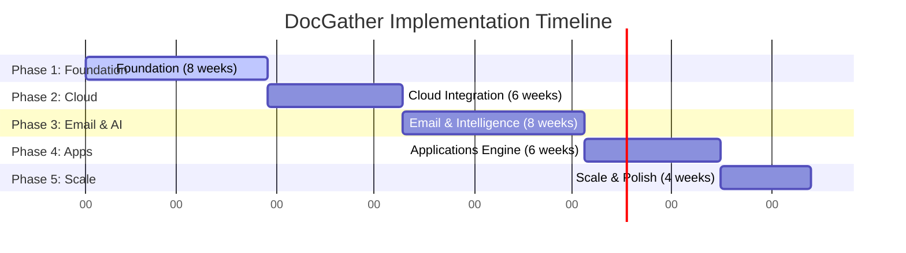

# 📊 CTO Implementation Guide

**Project Phases • Team Sizing • Cost Analysis • Timeline**

## 📋 Executive Summary

> [!NOTE]
> **Key Metrics**
>
> - **⏱️ Total Timeline:** **32 weeks** (~8 months to MVP + Scale)
> - **👥 Peak Team Size:** **6 people** (Scaling from 3 initially)
> - **💰 Monthly Costs:** **€325-3,100** (Infrastructure only)

## ⚡ Technical Challenges Matrix

| Challenge                      | Difficulty | Risk   | Mitigation Strategy                                        |
| :----------------------------- | :--------- | :----- | :--------------------------------------------------------- |
| **Multi-provider OAuth**       | Medium     | Medium | Use Supabase Auth + verified OAuth libraries per provider  |
| **Email attachment parsing**   | Hard       | Medium | Start with Gmail API only; use proven MIME libraries       |
| **OCR accuracy (French docs)** | Hard       | High   | Tesseract + fallback to cloud OCR; A/B test providers      |
| **LLM cost management**        | Medium     | High   | Aggressive caching, batching, tiered model selection       |
| **File format variety**        | Hard       | Medium | Parser fallback chain; convert unknowns to PDF             |
| **French document specifics**  | Medium     | Low    | Build French-specific prompt templates; iterate with users |
| **Data privacy (RGPD)**        | Medium     | High   | Encrypt at rest; minimize LLM data exposure; audit logging |

## 🚀 Project Phases

### Phase 1: Foundation (8 weeks)

**Goal:** Working MVP with file upload and basic extraction

**Deliverables**

- Supabase project setup (auth, database, storage, RLS)
- Web app with file upload (drag-drop, webkitdirectory)
- Basic PDF/image parsing with Tesseract + pdfplumber
- LLM extraction with GPT-4 for classification
- Document catalog with search (pg_trgm)
- User identity sheet (personal only)

**Milestones**

- [x] Week 2: Auth + Upload working
- [x] Week 4: Parser pipeline complete
- [x] Week 6: LLM extraction live
- [x] Week 8: Catalog + Search MVP

### Phase 2: Cloud Integration (6 weeks)

**Goal:** Connect major cloud drives and implement smart queueing

**Deliverables**

- Google Drive integration (OAuth, file listing, download)
- OneDrive integration
- Dropbox integration
- Smart queueing system with priority scoring
- Webhook-based incremental sync
- Background job processing (Supabase Edge Functions or external)

**Milestones**

- [x] Week 10: Google Drive live
- [x] Week 12: All cloud drives working
- [x] Week 14: Smart queue deployed

### Phase 3: Email & Intelligence (8 weeks)

**Goal:** Email integration and advanced AI features

**Deliverables**

- Gmail API integration (attachment extraction)
- Outlook/Microsoft Graph integration
- Advanced LLM classification (French-specific templates)
- Self-check validation layer
- Family member identity sheets
- Document deduplication by content hash

**Milestones**

- [x] Week 16: Gmail integration
- [x] Week 18: Outlook integration
- [x] Week 20: Self-check system
- [x] Week 22: Family identities

### Phase 4: Applications Engine (6 weeks)

**Goal:** Document selection and application management

**Deliverables**

- Application templates (rental, loan, hiring)
- Document selection algorithm
- LLM-assisted gap filling and justifications
- Application status tracking
- Push notifications for missing documents
- Business identity sheets

**Milestones**

- [x] Week 24: First app template
- [x] Week 26: Selection algorithm
- [x] Week 28: Notifications live

### Phase 5: Scale & Polish (4 weeks)

**Goal:** Performance optimization and mobile readiness

**Deliverables**

- Performance optimization (caching, query optimization)
- Mobile-responsive web app refinement
- Analytics dashboard (usage, costs, accuracy)
- Admin tools for document review
- Desktop app exploration (Electron/Tauri)
- Documentation and onboarding flows

**Milestones**

- [x] Week 30: Performance targets met
- [x] Week 32: Production ready

## 📅 Timeline Visualization

## 👥 Team Sizing Recommendations

| Phase       | Backend | Frontend | DevOps | ML/AI | Total FTE |
| :---------- | :------ | :------- | :----- | :---- | :-------- |
| **Phase 1** | 1       | 1        | 0.5    | 0.5   | **3**     |
| **Phase 2** | 1.5     | 1        | 0.5    | 0.5   | **3.5**   |
| **Phase 3** | 2       | 1        | 0.5    | 1     | **4.5**   |
| **Phase 4** | 2       | 1.5      | 0.5    | 1     | **5**     |
| **Phase 5** | 2       | 2        | 1      | 1     | **6**     |

### Team Composition Notes

- **🔵 Backend Developer**: Node.js/Python, PostgreSQL, Supabase, OAuth, queue systems
- **🟢 Frontend Developer**: React/Next.js, responsive design, file handling APIs
- **🟠 DevOps (Part-time)**: Supabase, CI/CD, monitoring, security
- **🟣 ML/AI Engineer**: LLM prompting, OCR, Python, evaluation metrics

## 💰 Infrastructure Cost Analysis

| Category              | Tool/Service                 | Monthly (Low) | Monthly (High) | Notes                      |
| :-------------------- | :--------------------------- | :------------ | :------------- | :------------------------- |
| **Platform**          | Supabase                     | €25           | €300           | Pro to Scale tier          |
| **LLM API**           | OpenAI / Anthropic           | €200          | €2,000         | Main variable cost         |
| **OCR**               | Tesseract (self-hosted)      | €0            | €0             | Free, runs on backend      |
| **OCR (backup)**      | Google Vision / AWS Textract | €50           | €500           | For complex documents      |
| **Storage**           | Supabase Storage / S3        | €20           | €150           | Depends on document volume |
| **Search (optional)** | Meilisearch Cloud            | €0            | €30            | If pg_trgm insufficient    |
| **Monitoring**        | Sentry / LogRocket           | €30           | €120           | Error tracking + analytics |
| **TOTAL**             |                              | **€325**      | **€3,100**     | Infrastructure only        |

> [!TIP]
> **Cost Optimization Strategies**
>
> - **LLM caching:** Cache extraction results by document hash (40-60% savings)
> - **Tiered models:** Use GPT-3.5/Claude Haiku for simple docs, GPT-4/Claude Sonnet for complex
> - **Batch processing:** Process 5-10 similar documents in single prompt
> - **Progressive extraction:** Only run OCR/LLM on documents that need it

## ⚠️ Risk Register

| Risk                      | Category    | Probability | Impact | Mitigation                                            |
| :------------------------ | :---------- | :---------- | :----- | :---------------------------------------------------- |
| LLM costs exceed budget   | Financial   | Medium      | High   | Set hard monthly caps; implement caching early        |
| OAuth provider changes    | Technical   | Low         | Medium | Abstract provider logic; monitor deprecation notices  |
| RGPD compliance gap       | Legal       | Medium      | High   | Legal review before launch; DPO consultation          |
| User data breach          | Security    | Low         | High   | Encryption at rest; RLS policies; security audit      |
| OCR accuracy insufficient | Technical   | Medium      | Medium | Multiple OCR fallbacks; user correction UI            |
| Team scaling challenges   | Operational | Medium      | Medium | Documentation; modular architecture; pair programming |

## 🛠️ Recommended Technology Stack

### Backend

- **Platform:** Supabase
- **Database:** PostgreSQL 15+
- **Auth:** Supabase Auth
- **Storage:** Supabase Storage
- **Functions:** Edge Functions (Deno)
- **Queue:** pg_boss or Inngest

### Frontend

- **Framework:** Next.js 14+
- **Styling:** Tailwind CSS
- **State:** Zustand or React Query
- **Upload:** react-dropzone
- **PDF Viewer:** react-pdf

### AI/ML

- **LLM:** GPT-4 / Claude 3
- **OCR:** Tesseract + fra pack
- **OCR Fallback:** Google Vision API
- **PDF:** pdfplumber (Python)
- **Embeddings:** pgvector (Phase 2)

## ✅ Immediate Next Steps

1. **Week 0:** Set up Supabase project with auth and storage
2. **Week 1:** Build file upload UI with client-side filtering
3. **Week 1:** Implement PDF parsing pipeline with Tesseract
4. **Week 2:** Create LLM extraction prompts for French documents
5. **Week 2:** Design database schema for document catalog
6. **Week 3:** Build search with pg_trgm extension
7. **Week 4:** Internal testing with real French documents

---

_DocGather CTO Implementation Guide • Version 1.0 • January 2026_
