# 🔬 Document Engine Analysis

**Deep Technical Analysis • Flowcharts • Tool Comparisons • Best Practices**

## 📑 Table of Contents

1. [Sourcing Module Analysis](#1-sourcing-module-analysis)
2. [Smart Queueing System](#2-smart-queueing-system)
3. [Parser/Extractor Choice](#3-parserextractor-choice)
4. [Document Parsing & Extraction](#4-document-parsing--extraction)
5. [Self-Check Mechanisms](#5-self-check-mechanisms)
6. [Database & Catalog Comparison](#6-database--catalog-comparison)
7. [Document Selection Algorithm](#7-document-selection-algorithm)
8. [LLM Strategy & Recommendations](#8-llm-strategy--recommendations)

## 1️⃣ Sourcing Module Analysis

Analysis of each document source with challenges, recommendations, and implementation complexity.

### ☁️ Cloud Drives (Google Drive, OneDrive, Dropbox, iCloud, Box)

> [!NOTE]
> **Overview**
>
> - **Integration Method**: OAuth 2.0 with official SDKs
> - **Rate Limits**: Google: 1B queries/day; OneDrive: 10K/10min; Dropbox: 200K/month
> - **Webhook Support**: All major providers support change notifications
> - **Difficulty**: Medium

#### Challenges

- **Token refresh:** OAuth tokens expire, need background refresh logic
- **Format variety:** Google Docs need export to PDF/DOCX before processing
- **Shared drives:** Different permission models require careful handling
- **iCloud:** No official API - requires workarounds or desktop app sync

> [!TIP]
> **Recommendation**
> Start with Google Drive and OneDrive (largest market share). Use webhooks for incremental sync. Store provider tokens in encrypted Supabase vault. Consider `rclone` as abstraction layer for unified access.

### 📧 Email Sources (Gmail, Outlook)

> [!WARNING]
> **Comparison**
>
> | Aspect                | Gmail                 | Outlook               |
> | :-------------------- | :-------------------- | :-------------------- |
> | **Protocol**          | Gmail API / IMAP      | Graph API / IMAP      |
> | **Attachment Access** | Direct via API        | Direct via API        |
> | **Search**            | Powerful query syntax | $filter OData queries |
> | **Difficulty**        | Hard                  | Hard                  |

#### Email-Specific Challenges

- **Attachment extraction:** Multi-part MIME parsing, inline vs attached files
- **Email threading:** Same document may appear in multiple emails (replies)
- **Size limits:** Large attachments may be links (Google Drive links in Gmail)
- **Privacy concerns:** Users hesitant to grant full mailbox access
- **Volume:** Years of emails = millions of items to scan

#### Strategies vs Limitations

**✅ Strategies**

- Filter by has:attachment + date range
- Use labels/folders as hints
- Scan incrementally from recent
- Deduplicate by hash

**⚠️ Limitations**

- IMAP is slow for bulk operations
- API quotas limit throughput
- Cannot access drafts/sent reliably

### 📁 Local Files - Upload Method

#### "Select All" Behavior Analysis

| Platform              | Subfolder Behavior                | Limitations                                |
| :-------------------- | :-------------------------------- | :----------------------------------------- |
| Web (Chrome/Firefox)  | Cannot select folders, only files | User must use "Upload folder" or drag-drop |
| Web (webkitdirectory) | Recursive subfolder inclusion     | Chrome/Edge only, prompts permission       |
| iOS Safari            | Photos or Files app selection     | Limited to 50-100 files per selection      |
| Android Chrome        | File picker shows folders         | No recursive select in standard picker     |

#### Client-Side Filtering Necessity

- **File type filtering:** Skip .exe, .dll, .tmp, system files
- **Size filtering:** Skip files >50MB (unlikely documents)
- **Extension whitelist:** PDF, DOC/DOCX, JPG/PNG, XLS/XLSX
- **Progress feedback:** Show count + estimated relevance before upload

> [!TIP]
> **Recommendation**
> Use drag-drop with `webkitdirectory` for desktop. For mobile, implement a "smart scan" that previews file counts by type before upload. Consider chunked uploads with resume capability.

### 📱 Local Files - Desktop/Mobile App Method

> [!NOTE]
> **Desktop App Challenges**
>
> | Challenge           | Windows                   | macOS                                     |
> | :------------------ | :------------------------ | :---------------------------------------- |
> | Permissions         | UAC for protected folders | TCC prompts for Documents/Desktop         |
> | Restricted Folders  | System32, Program Files   | Library, System folders pop notifications |
> | Removable Drives    | Drive letter changes      | Volume UUID tracking needed               |
> | Background Scanning | Windows Service possible  | Launch Agent with limitations             |

#### Mobile App Challenges

- **iOS:** Sandboxed - can only access Files app with user consent per session
- **Android:** Scoped Storage (Android 11+) severely limits file access
- **Solution:** Use system "Share" sheet - user shares files TO the app

#### Removable Drive Issues

- File moved but drive disconnected = broken reference
- Hash the file content for identity, not just path
- Mark source as "volatile" in priority queue
- Alert user when important docs are on removable storage

## 2️⃣ Smart Queueing System

At this stage, we only have file metadata. The queue prioritizes which files to process first.


### Priority Scoring Formula

```python
priority = (volatility * 50) + (user_action * 40) + \
           (source_freshness * 30) + (needs_update * -20) + (fills_gap * 60) + \
           (file_age_score * 10)
```

**Example:** User manually uploaded from USB drive with a missing payslip = 50 + 40 + 0 + 0 + 60 = **150 points** (highest priority)

## 3️⃣ Parser/Extractor Choice

Decision tree for selecting the optimal extraction method based on file characteristics.

```mermaid
graph TD
    Start([File Received]) --> Check{Check<br/>Format}

    Check -->|PDF| PDFCheck{Text?}
    PDFCheck -->|No| OCR[OCR Tesseract]
    PDFCheck -->|Yes| LLM[LLM Extraction]

    Check -->|IMG| Vision[LLM Vision API]

    Check -->|DOC/XLS| Office[Office Parser<br/>python-docx, openpyxl]
    Office --> LLM

    Check -->|Unknown| PDFConvert[Convert to PDF → Retry]

    OCR --> LLMClass[LLM Classification]
    LLM --> LLMClass
    Vision --> LLMClass
    PDFConvert --> LLMClass
```



### Parser Tool Comparison

| Tool                | Use Case               | Accuracy | Speed  | Cost           |
| :------------------ | :--------------------- | :------- | :----- | :------------- |
| `pdfplumber`        | Native PDF text        | 95%      | Fast   | **Free**       |
| `Tesseract OCR`     | Scanned PDFs, images   | 85-90%   | Medium | **Free**       |
| `Google Vision API` | Complex layouts        | 95%+     | Medium | $1.50/1K pages |
| `AWS Textract`      | Forms, tables          | 95%+     | Medium | $1.50/1K pages |
| `GPT-4 Vision`      | Document understanding | 98%+     | Slow   | $0.01/image    |
| `Claude Vision`     | Document understanding | 97%+     | Medium | $0.008/image   |

> [!TIP]
> **Recommendation**
> Use **Tesseract + pdfplumber** as free tier defaults. Escalate to **LLM Vision** for low-confidence results or complex documents. For French documents, ensure Tesseract uses `fra` language pack.

## 4️⃣ Document Parsing & Extraction

The LLM extraction produces standardized outputs for all document types.

### LLM Output Schema

**📋 Metadata Card**

```json
{
  "document_type": "payslip",
  "issuer": "Acme Corp",
  "date": "2025-12-01",
  "language": "fr",
  "confidence": 0.94,
  "summary": "December 2025 payslip"
}
```

**📊 Data Card (Structured)**

```json
{
  "template": "income.payslip",
  "employee_name": "Jean Dupont",
  "employer": "Acme Corp",
  "period": "2025-12",
  "gross_salary": 3500.0,
  "net_salary": 2730.0,
  "currency": "EUR"
}
```

### Data Templates by Category

| Category  | Template                   | Key Fields                                              |
| :-------- | :------------------------- | :------------------------------------------------------ |
| Identity  | `identity.passport`        | full_name, nationality, birth_date, expiry_date, number |
| Identity  | `identity.id_card`         | full_name, birth_date, expiry_date, number              |
| Residence | `residence.utility_bill`   | address, provider, date, amount                         |
| Residence | `residence.rent_receipt`   | address, landlord, tenant, period, amount               |
| Work      | `work.employment_contract` | employer, employee, start_date, position, salary        |
| Income    | `income.tax_notice`        | year, revenue, tax_amount, reference                    |
| Income    | `income.payslip`           | employer, employee, period, gross, net                  |

### Full-Text Extraction Guidelines

> [!NOTE]
>
> - **Keep:** All readable text content, headers, dates, amounts
> - **Discard:** Boilerplate (page numbers, footers), illegible sections, decorative elements
> - **Normalize:** Dates to ISO format, amounts to numbers, names to proper case
> - **Index:** Store for full-text search with document reference

## 5️⃣ Self-Check Mechanisms

Validation layer to ensure extraction quality and enable continuous improvement.

### ✅ Validation Checks

- **Schema validation:** Required fields present?
- **Date sanity:** Dates within reasonable range?
- **Amount validation:** Numbers parseable, currency correct?
- **Confidence threshold:** LLM confidence > 0.8?
- **Cross-reference:** Employer matches known identity?

### 🔄 Retry Logic

- If confidence < 0.7: Try alternate parser
- If OCR failed: Try different preprocessing
- If schema invalid: Flag for manual review
- Store extraction attempts for learning

### Feedback Loop for Improvement

> [!NOTE]
> Store tuples of `(file_metadata, chosen_parser, extraction_result, success_score)` to train the parser choice model over time. After 1000+ samples, use this data to:
>
> - Predict best parser before attempting extraction
> - Identify document types that need specialized handling
> - Detect drift in document formats from specific issuers

## 6️⃣ Database & Catalog Comparison

Evaluating storage and search solutions for the document catalog.

### Primary Database: PostgreSQL (Supabase)

The core catalog lives in PostgreSQL. Document metadata, data cards, and relationships are stored here.

**✅ Pros**

- ACID transactions
- Complex queries with JOINs
- Row-level security (RLS)
- Supabase integration
- Cost-effective

**⚠️ Limitations**

- Basic full-text search
- No fuzzy matching native
- No typo tolerance

### Search Enhancement Options

| Solution          | Type      | Pros                             | Cons                      | Cost          | Verdict         |
| :---------------- | :-------- | :------------------------------- | :------------------------ | :------------ | :-------------- |
| **pg_trgm + GIN** | Extension | Native, fuzzy matching, no infra | Limited features          | **Free**      | **Start Here**  |
| **pgvector**      | Extension | Semantic search, embeddings      | Needs embedding model     | **Free**      | **Phase 2**     |
| **Elasticsearch** | External  | Powerful, aggregations, mature   | Ops overhead, sync needed | $95-300/mo    | **If needed**   |
| **Meilisearch**   | External  | Fast, typo-tolerant, simple API  | Less mature, sync needed  | Free-$30/mo   | **Recommended** |
| **Typesense**     | External  | Fast, open-source, geo-search    | Smaller ecosystem         | Free-$25/mo   | **Good Alt**    |
| **Algolia**       | SaaS      | Best UX, instant search          | Expensive at scale        | $1/1K records | **Not Rec.**    |

> [!TIP]
> **Recommended Architecture**
>
> 1.  **Phase 1:** PostgreSQL with `pg_trgm` extension for basic fuzzy search
> 2.  **Phase 2:** Add `pgvector` for semantic search when catalog grows
> 3.  **Phase 3:** If UX demands instant search, add Meilisearch as secondary index synced via triggers

## 7️⃣ Document Selection Algorithm

Assigning the best documents to application slots.

### Selection Criteria (Weighted)

| Criterion           | Weight | Description                            |
| :------------------ | :----- | :------------------------------------- |
| Document Type Match | 30%    | Exact match to required category       |
| Recency             | 25%    | More recent = higher score             |
| Acceptance Rules    | 20%    | Known to be accepted for this app type |
| Completeness        | 15%    | All required fields extracted          |
| Quality Score       | 10%    | Extraction confidence, readability     |

### LLM-Assisted Selection for Edge Cases

When standard matching fails (e.g., user changed jobs mid-sequence), invoke LLM with:

```text
Prompt: "Application requires 3 consecutive monthly payslips. User has:
- Payslip Dec 2025 (Employer A)
- Payslip Nov 2025 (Employer A)
- Employment termination letter Oct 2025 (Employer A)
- Employment contract Nov 2025 (Employer B)
- Payslip Dec 2025 (Employer B)
Select best documents and provide justification note for the application."
```

**LLM Output:** Selected documents + human-readable justification to include with application.

## 8️⃣ LLM Strategy & Recommendations

Guidelines for when to use LLMs vs traditional algorithms.

### 🤖 When to Use LLM (Long Prompts, Big Context)

- **Document classification:** Too many edge cases for rules
- **Data extraction:** Unstructured text → structured JSON
- **Edge case resolution:** Sequential gaps, substitutions
- **User-facing summaries:** Natural language descriptions
- **Multi-doc reasoning:** Cross-reference identities across documents

### ⚡ When to Use Algorithms/Database

- **Sorting & filtering:** Date ranges, type filters
- **Exact matching:** Document ID, hash deduplication
- **Aggregations:** Count by type, total amounts
- **Access control:** RLS policies
- **Caching:** Previously computed scores

### LLM Cost Optimization

| Strategy                 | Savings | Implementation                             |
| :----------------------- | :------ | :----------------------------------------- |
| Batch similar documents  | 30-50%  | Process 5-10 similar docs in one prompt    |
| Cache common extractions | 40-60%  | Hash document → check cache before LLM     |
| Use smaller models first | 70-80%  | GPT-3.5 for simple docs, GPT-4 for complex |
| Structured output mode   | 10-20%  | JSON mode reduces token waste              |

> [!TIP]
> **Key Insight**
> For DocGather, **prioritize LLM with long, detailed prompts** over building complex database queries and algorithm chains. The document classification problem has too many French-specific edge cases (attestation sur l'honneur, documents from specific institutions) to codify in rules. Use the **200K+ token context windows** of modern LLMs to include document schemas, examples, and classification guidelines in a single prompt.

---

_DocGather Document Engine Analysis • Version 1.0 • January 2026_
