# 📄 DocGather

**Intelligent Document Search, Extraction & Cataloging**
🇫🇷 Built for French Individuals & Businesses

## 📋 Business Context

DocGather addresses the challenge of locating and organizing important personal and business documents scattered across multiple digital locations. The system automates the discovery, classification, and management of documents needed for administrative procedures.

### 🎯 Problem Statement

Users store critical documents across cloud drives, emails, and local files. When needed for applications (flat rental, loan, hiring), finding the right documents becomes time-consuming and error-prone.

### 💡 Solution

An intelligent system that automatically discovers, extracts, classifies, and catalogs documents, then recommends the best documents for each application based on requirements and availability.

### 🏆 Value Proposition

Save hours of manual document searching. Never miss a deadline due to missing documents. Maintain an always-updated repository of administrative documents.

### 📊 Success Metrics

Time saved per application, document retrieval accuracy, user satisfaction scores, application completion rates, and catalog completeness percentage.

## 📁 Document Types

DocGather identifies and catalogs four primary categories of administrative documents commonly required for French procedures:

### 🪪 Identity Proofs

**Official documents proving personal identity**

- National ID cards (CNI)
- Passports
- Driver's licenses
- Residence permits (Titre de séjour)

### 🏠 Proof of Residence

**Documents confirming current address**

- Utility bills (EDF, Engie, water)
- Rent receipts (Quittance de loyer)
- Property tax notice (Taxe foncière)
- Proof of accommodation letter
- Home insurance certificate

### 💼 Proof of Work Status

**Documents confirming employment or business**

- Employment contracts (CDI, CDD)
- Internship agreements
- Business ownership proof (Kbis)
- Student ID cards
- Professional licenses

### 💰 Proof of Income

**Documents proving financial capacity**

- Tax notices (Avis d'imposition)
- Payslips (Bulletins de paie)
- Business balance sheets
- Social security payments (CAF)
- Bank statements

## 👥 Identity Management

DocGather maintains identity sheets for individuals and entities, enabling document association and family/business document management:

### 👤 Personal Identity (Primary)

**The main user's identity sheet including:**

- Full legal name and aliases
- Date and place of birth
- Current and previous addresses
- Document validity tracking
- Employment history

### 👨‍👩‍👧‍👦 Family Members (Extended)

**Supporting identity sheets for:**

- Partner/Spouse
- Children (minor and adult)
- Parents (for elder care scenarios)
- Dependents with linked documents

### 🏢 Business Identity (Enterprise)

**For business applications:**

- Company registration (SIREN/SIRET)
- Legal structure and status
- Employee directory
- Client list (when applicable)
- Financial documents association

## 🏗️ System Architecture

High-level overview of the DocGather document processing pipeline:

```mermaid
graph LR
    subgraph Sources [SOURCES]
        CD[☁️ Cloud Drives]
        EM[📧 Emails]
        LF[📁 Local Files]
        MA[📱 Mobile App]
    end

    subgraph Queue [QUEUE]
        SQ[🔄 Smart Queue<br/>Priority Sorting]
    end

    subgraph Processing [PROCESSING]
        PC[📄 Parser Choice<br/>OCR / LLM / Native]
        LE[🤖 LLM Extraction<br/>Classification + Data]
        SC[✅ Self-Check<br/>Validation Loop]
    end

    subgraph db [CATALOG]
        PG[🗄️ PostgreSQL<br/>Document Catalog]
        SI[🔍 Search Index<br/>Full-text + Filters]
        IS[👥 Identity Store<br/>Personal + Business]
    end

    subgraph Output [OUTPUT]
        AP[📋 Applications]
        RC[🎯 Recommendations]
        NO[🔔 Notifications]
    end

    CD --> SQ
    EM --> SQ
    LF --> SQ
    MA --> SQ

    SQ --> PC
    PC --> LE
    LE --> SC

    SC --> PG
    SC --> SI

    PG --> AP
    PG --> RC
    PG --> NO

    SI -.-> IS

    %% User Feedback Loop
    NO -.-> |🔄 User Feedback Loop| PC
```

## ⚡ Edge Cases & Special Handling

DocGather handles complex scenarios that arise in real-world document collection:

### 📅 Sequential Document Requirements

> [!WARNING]
> **Challenge:** Some applications require sequential documents (e.g., "3 latest monthly payslips" or "2 most recent annual tax notices").
>
> **Solution:** The system tracks document dates and maintains series completeness. When gaps exist (e.g., job change), it:
>
> - Identifies the gap in the sequence
> - Suggests alternative documents to fill the gap
> - Provides a justification note for the application

### 🚫 Document Acceptance Variations

> [!WARNING]
> **Challenge:** Certain proof types aren't accepted universally (e.g., mobile phone bills rejected as proof of address by some institutions).
>
> **Solution:** Each application template includes an acceptance matrix. The system:
>
> - Checks document type against application requirements
> - Warns users when a document might not be accepted
> - Suggests better alternatives when available

### 👨‍👩‍👧 Multi-Person Applications

> [!NOTE]
> **Challenge:** Joint applications (e.g., couple renting together) require documents from multiple identities.
>
> **Solution:** The system links family member profiles and:
>
> - Tracks document requirements per person
> - Shows combined progress for joint applications
> - Manages document access permissions

### ⏰ Document Validity Tracking

> [!NOTE]
> **Challenge:** Documents expire or become outdated (ID cards, utility bills older than 3 months).
>
> **Solution:** Automatic validity monitoring:
>
> - Tracks expiration dates for identity documents
> - Flags utility bills older than 3 months
> - Proactively alerts users to refresh documents

## ✨ Key Features

### 🔍 Multi-Source Discovery

Connect Google Drive, OneDrive, Dropbox, Gmail, Outlook, and local files to find documents everywhere.

### 🤖 AI-Powered Extraction

LLM-based classification and data extraction with OCR support for scanned documents.

### 🏷️ Automatic Classification

Documents are automatically categorized by type, date, and relevance without manual tagging.

### 📊 Application Templates

Pre-built templates for common French procedures (rental, loan, hiring) with document checklists.

### 🎯 Smart Recommendations

AI suggests the best documents for each application based on quality, recency, and acceptance rules.

### 👥 Family & Business Support

Manage documents for household members and business entities with proper access controls.

### 🔔 Proactive Alerts

Get notified about expiring documents, application deadlines, and missing items.

### 🔒 Secure Storage

End-to-end encryption for sensitive documents with GDPR compliance built-in.

## 🇫🇷 French Market Focus

DocGather is specifically designed for the French administrative context:

### 📜 French Document Standards

Recognition of French-specific documents: CNI, Livret de famille, Avis d'imposition, Kbis extracts, and attestations from French institutions.

### 🏛️ Administrative Procedures

Built-in knowledge of requirements for CAF, Pôle Emploi, préfecture, landlord applications, and banking procedures.

### 🌐 Bilingual Support

Interface available in French and English, with document recognition supporting both languages.

### ⚖️ RGPD Compliance

Full compliance with French and European data protection regulations, including data portability and right to deletion.

---

_DocGather Project Overview • Version 1.0 • January 2026_
